# Architecture Documentation

This document describes the system architecture, design decisions, and component interactions of the P2P Folder Sync system.

## Table of Contents

1. [System Overview](#system-overview)
2. [Architecture Diagrams](#architecture-diagrams)
3. [Core Components](#core-components)
4. [Data Flow](#data-flow)
5. [Network Protocol](#network-protocol)
6. [Storage Architecture](#storage-architecture)
7. [Security Architecture](#security-architecture)
8. [Design Decisions](#design-decisions)
9. [Scalability Considerations](#scalability-considerations)
10. [Future Enhancements](#future-enhancements)

---

## System Overview

P2P Folder Sync is a distributed peer-to-peer file synchronization system that maintains consistent copies of a shared folder across multiple peers in a local network.

### Key Characteristics

- **Architecture**: Decentralized peer-to-peer
- **Consistency Model**: Eventual consistency with vector clocks
- **Communication**: Direct peer-to-peer with QUIC/TCP
- **Discovery**: Automatic via mDNS/DNS-SD
- **Encryption**: End-to-end with AES-256-GCM
- **Conflict Resolution**: 3-way merge for text, LWW for binary

### Design Philosophy

1. **No Central Server**: Fully decentralized architecture
2. **Automatic Recovery**: Resilient to network failures
3. **Data Integrity**: Cryptographic hashes verify all data
4. **Performance**: Chunking, compression, and parallel transfers
5. **Security First**: End-to-end encryption by default

---

## Architecture Diagrams

### High-Level System Architecture

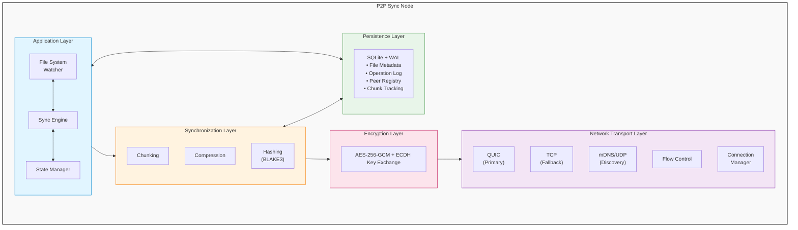

### Component Interaction Diagram

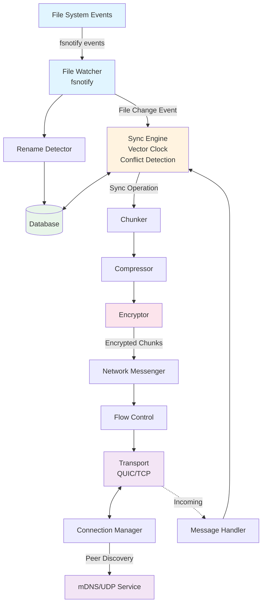

### Multi-Peer Network Topology

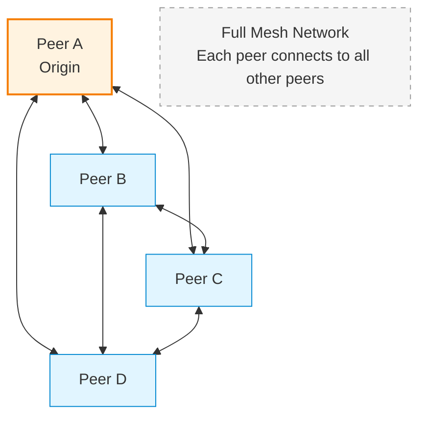

---

## Core Components

### 1. Sync Engine (`internal/sync/`)

**Purpose**: Orchestrates all synchronization operations.

**Responsibilities**:
- Maintain vector clocks for causality tracking
- Process incoming file operations
- Detect and resolve conflicts
- Coordinate with other components

**Key Interfaces**:
```go
type Engine struct {
    peerID      string
    db          *database.DB
    messenger   Messenger
    vectorClock VectorClock
    // ...
}

func (e *Engine) ProcessLocalChange(path string, eventType EventType) error
func (e *Engine) HandleIncomingFile(data []byte, op *SyncOperation) error
func (e *Engine) HandleIncomingRename(op *SyncOperation) error
```

**Design Patterns**:
- **Observer Pattern**: Watches file system events
- **Command Pattern**: Sync operations as commands
- **Strategy Pattern**: Different conflict resolution strategies

### 2. Network Layer (`internal/network/`)

**Purpose**: Handles all peer-to-peer communication.

**Components**:

#### NetworkMessenger
- Sends/receives messages
- Manages encryption
- Handles retries and acknowledgments

#### NetworkMessageHandler
- Routes incoming messages to handlers
- Processes different message types
- Manages chunk assembly

#### Transport Layer
- **QUIC Transport**: Primary, fast, multiplexed
- **TCP Transport**: Fallback for compatibility
- **Automatic Failover**: Switches on QUIC failure

#### Connection Manager
- Tracks active peer connections
- Manages session keys
- Updates connection states

**Key Methods**:
```go
func (nm *NetworkMessenger) SendFile(peerID string, fileData []byte, metadata *SyncOperation) error
func (nm *NetworkMessenger) BroadcastOperation(op *SyncOperation) error
func (h *NetworkMessageHandler) HandleMessage(msg *Message) error
```

### 3. File System Layer (`internal/filesystem/`)

**Purpose**: Monitors and manipulates file system.

**Components**:

#### File Watcher
- Uses `fsnotify` for file system events
- Filters out remote changes (sync loop prevention)
- Debounces rapid changes

#### Rename Detector
- Distinguishes renames from delete+create
- Uses stable file IDs (BLAKE3 hash of content prefix)
- Temporal analysis (5-second window)

#### File Operations
- Atomic file writes (temp + rename)
- Permission preservation
- Extended attributes (xattr) management

**Sync Loop Prevention**:
```go
// Mark all incoming writes as remote
operation := FileOperation{
    Source: "remote",  // Critical: prevents re-broadcast
    // ...
}

// Temporarily disable watcher for this path
fileWatcher.IgnorePath(metadata.Path)
defer fileWatcher.WatchPath(metadata.Path)
```

### 4. Storage Layer (`internal/database/`)

**Purpose**: Persistent state management with SQLite.

**Database Schema**:
- **files**: File metadata with compression info
- **operations**: Append-only operation log
- **peers**: Peer registry
- **chunks**: Chunk tracking for resumable transfers

**Configuration**:
- Write-Ahead Logging (WAL) for concurrency
- Automatic checkpointing
- Periodic log compaction

**Design Benefits**:
- ACID transactions
- Crash recovery via operation log
- Efficient queries with proper indexes

### 5. Chunking System (`internal/chunking/`)

**Purpose**: Split large files into manageable chunks.

**Components**:

#### Chunker
- Adaptive chunk sizing (64KB - 2MB)
- Generates chunk metadata
- Computes chunk hashes (BLAKE3)

#### Assembler
- Handles out-of-order chunk delivery
- Verifies chunk integrity
- Assembles complete files

**Chunk Structure**:
```go
type Chunk struct {
    FileID      string
    ChunkID     int      // Sequential number
    Offset      int64    // Byte offset in file
    Length      int64    // Chunk size
    Data        []byte   // Chunk content
    Hash        string   // BLAKE3(Data)
    IsLast      bool
    TotalChunks int
}
```

### 6. Compression Layer (`internal/compression/`)

**Purpose**: Reduce transfer size and improve efficiency.

**Supported Algorithms**:
- **Zstandard (zstd)**: Best compression ratio, default
- **LZ4**: Very fast, lower compression
- **Gzip**: Compatible, moderate performance

**Factory Pattern**:
```go
func NewCompressor(algorithm string, level int) (Compressor, error)
```

### 7. Crypto Layer (`internal/crypto/`)

**Purpose**: End-to-end encryption and key exchange.

**Components**:

#### Key Exchange
- ECDH with Curve25519
- Session key derivation (HKDF-SHA256)
- 24-hour key rotation

#### Encryption
- AES-256-GCM (authenticated encryption)
- 96-bit random IV per message
- 128-bit authentication tag

**Message Flow**:
```
Plaintext → JSON Encoding → AES-256-GCM Encryption → Network
Network → GCM Decryption → JSON Decoding → Plaintext
```

### 8. Observability (`internal/monitoring/`, `internal/observability/`)

**Purpose**: Metrics, tracing, and logging.

**Components**:
- OpenTelemetry metrics collection
- Distributed tracing
- Structured JSON logging
- Prometheus metrics endpoint

---

## Data Flow

### File Creation/Update Flow

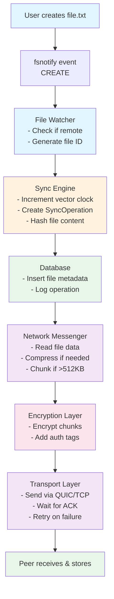

### File Receive Flow

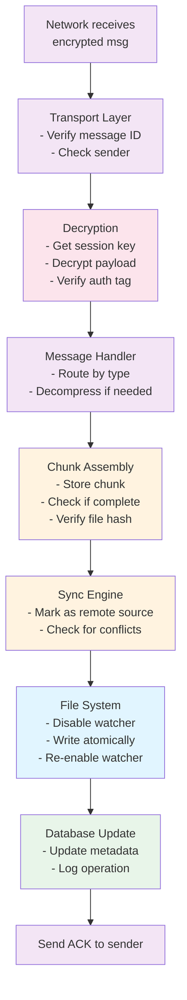

### Conflict Resolution Flow

```mermaid
flowchart TD
    Start[Two peers edit<br/>same file]
    VectorClock[Vector Clock Comparison<br/>Peer A: &#123;A:5, B:3&#125;<br/>Peer B: &#123;A:4, B:6&#125;<br/>→ Concurrent!]
    Detection[Conflict Detection<br/>- Same file ID<br/>- Different checksums<br/>- Concurrent clocks]
    IsText{Is Text File?}
    ThreeWay[3-Way Merge]
    LWW[Last Write Wins<br/>LWW]
    Apply[Apply Resolution<br/>- Update file<br/>- Merge vector clocks<br/>- Broadcast result]

    Start --> VectorClock
    VectorClock --> Detection
    Detection --> IsText
    IsText -->|Yes| ThreeWay
    IsText -->|No| LWW
    ThreeWay --> Apply
    LWW --> Apply

    style Start fill:#e1f5ff
    style VectorClock fill:#fff3e0
    style Detection fill:#fff3e0
    style IsText fill:#fff9c4
    style ThreeWay fill:#f3e5f5
    style LWW fill:#f3e5f5
    style Apply fill:#e8f5e9
```

---

## Network Protocol

### Message Types and Flow

#### Discovery and Connection

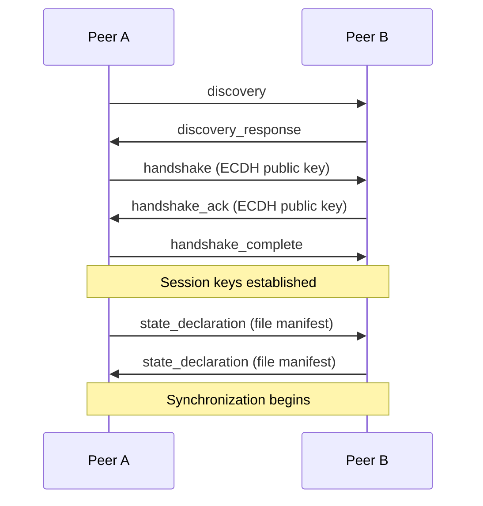

#### File Synchronization

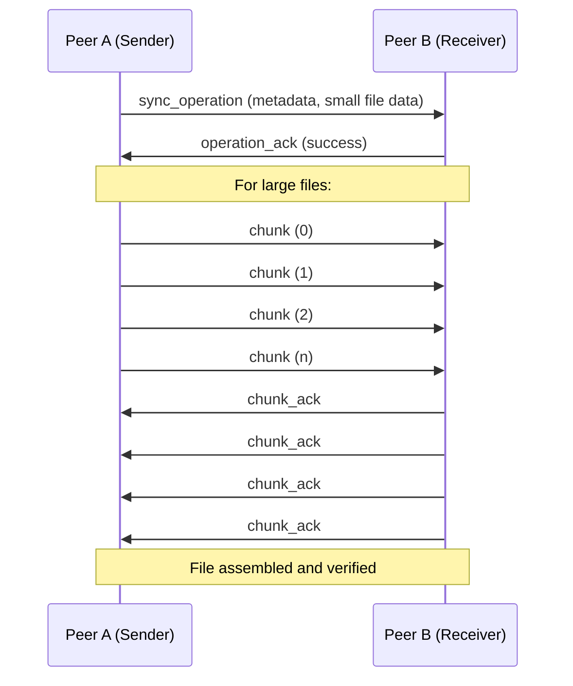

### Protocol Layers

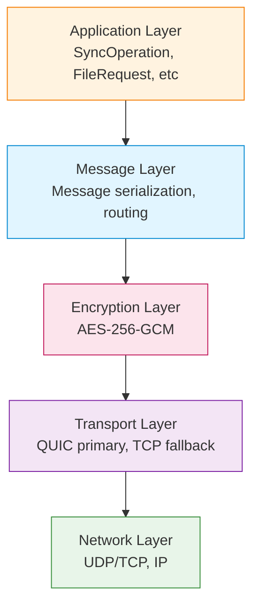

---

## Storage Architecture

### Database Design

**SQLite Database (WAL Mode Enabled)**

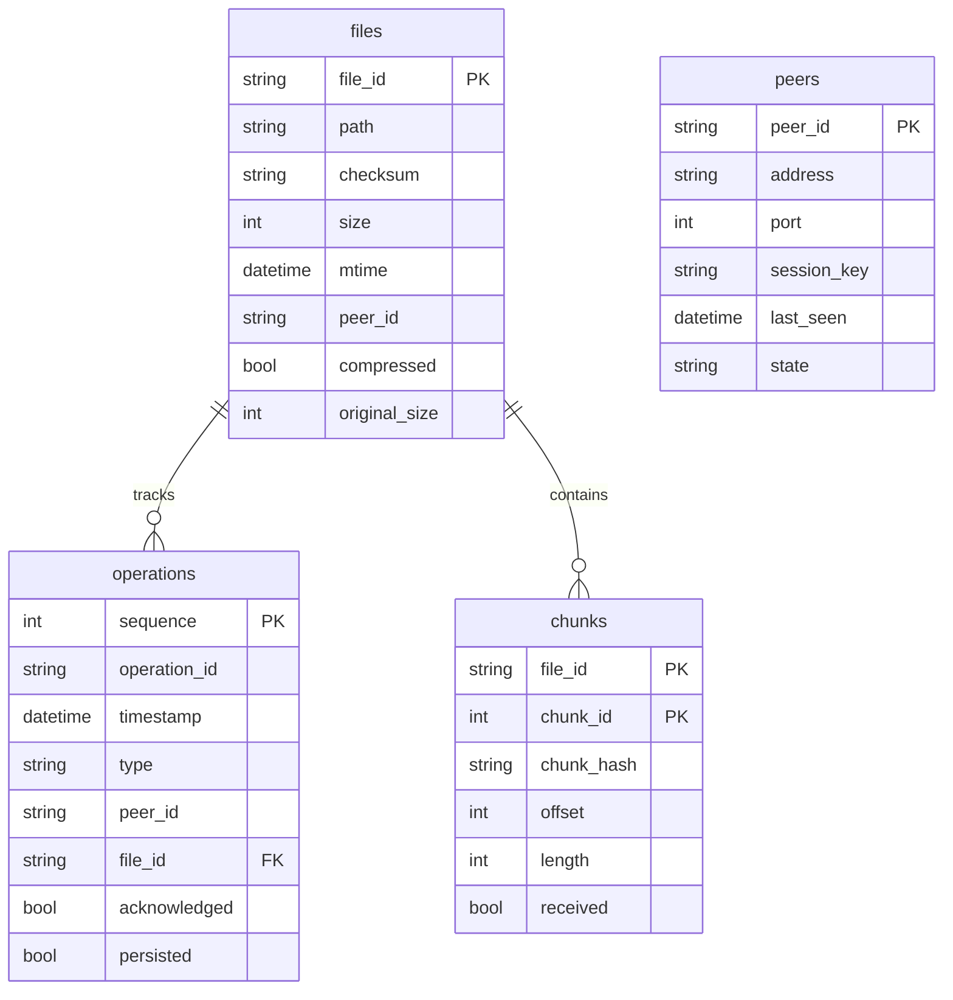

### File System Layout

```
/var/lib/p2p-sync/
├── sync/                    # Synchronized folder
│   ├── file1.txt
│   ├── file2.jpg
│   └── subdir/
│       └── file3.pdf
├── data/                    # Application data
│   ├── p2p_sync.db          # SQLite database
│   ├── p2p_sync.db-wal      # Write-ahead log
│   └── p2p_sync.db-shm      # Shared memory
└── logs/                    # Application logs
    └── p2p-sync.log
```

---

## Security Architecture

### Threat Model

**Threats Considered**:
1. Eavesdropping on network traffic
2. Man-in-the-middle attacks
3. Data tampering in transit
4. Unauthorized peer access
5. File corruption (accidental or malicious)

**Threats NOT Addressed**:
1. Compromised peer nodes (trusted environment assumed)
2. Physical access to storage
3. DoS attacks
4. Supply chain attacks

### Security Layers

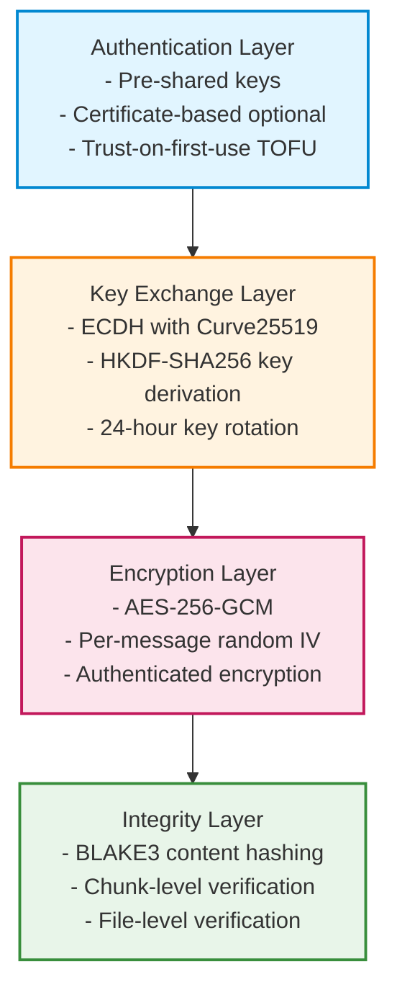

---

## Design Decisions

### 1. Why P2P Instead of Client-Server?

**Decision**: Fully decentralized peer-to-peer architecture

**Rationale**:
- ✅ No single point of failure
- ✅ Scales horizontally without server upgrades
- ✅ Works in air-gapped environments
- ✅ Lower latency (direct peer communication)
- ❌ More complex conflict resolution
- ❌ Harder to maintain global consistency

**Trade-offs Accepted**: Eventual consistency model instead of strong consistency

### 2. Why SQLite Instead of Key-Value Store?

**Decision**: SQLite with WAL mode

**Rationale**:
- ✅ ACID transactions for consistency
- ✅ Powerful query capabilities (complex filters, joins)
- ✅ Built-in crash recovery
- ✅ No external dependencies
- ✅ Excellent performance for <100GB datasets
- ❌ Not suitable for massive scale (millions of files)

### 3. Why QUIC with TCP Fallback?

**Decision**: QUIC as primary, TCP as fallback

**Rationale**:
- ✅ QUIC: Multiplexing without head-of-line blocking
- ✅ QUIC: Faster connection establishment (0-RTT)
- ✅ TCP: Universal compatibility
- ✅ TCP: Works through restrictive firewalls
- ❌ Added complexity of dual stack

### 4. Why Vector Clocks for Causality?

**Decision**: Vector clocks instead of Lamport timestamps

**Rationale**:
- ✅ Detects concurrent operations accurately
- ✅ Enables better conflict detection
- ✅ Works in distributed environment
- ❌ O(n) space per peer (n = number of peers)
- ❌ Requires periodic compaction

**Alternatives Considered**: Lamport timestamps (insufficient), hybrid logical clocks (too complex)

### 5. Why BLAKE3 Instead of SHA-256?

**Decision**: BLAKE3 for all hashing

**Rationale**:
- ✅ 10x faster than SHA-256
- ✅ Parallelizable (SIMD support)
- ✅ Cryptographically secure
- ✅ Incremental hashing support
- ❌ Less widely known (but well-vetted)

### 6. Why In-Memory Testing (InMemoryMessenger)?

**Decision**: Mock messenger for fast unit tests

**Rationale**:
- ✅ Tests run in milliseconds instead of seconds
- ✅ No network flakiness in CI/CD
- ✅ Easier to simulate failure scenarios
- ✅ Deterministic test execution
- ❌ Doesn't test real network behavior (covered by integration tests)

---

## Scalability Considerations

### Current Limits

| Aspect | Current Limit | Bottleneck |
|--------|---------------|------------|
| Peers | ~50 peers | Vector clock size, broadcast overhead |
| Files | ~1 million | SQLite performance, memory for manifest |
| File Size | ~10 GB | Memory for chunk buffers |
| Throughput | ~500 MB/s | Network bandwidth, CPU for encryption |
| Sync Latency | <1 second | Network RTT, processing time |

### Scaling Strategies

#### Horizontal Scaling
- Add more peers to distribute load
- Geographic distribution reduces latency
- Each peer handles full dataset (redundancy)

#### Vertical Scaling
- More CPU: Faster hashing and compression
- More RAM: Larger chunk buffers, more concurrent transfers
- Faster storage: SSD improves database performance

#### Optimization Opportunities
1. **Delta Sync**: Only send changed blocks (rsync-style)
2. **Merkle Trees**: Efficient bulk synchronization
3. **Selective Sync**: Only sync subset of files per peer
4. **Hierarchical P2P**: Introduce super-peers for large networks

---

## Future Enhancements

### Planned Features

1. **NAT Traversal** (High Priority)
   - STUN/TURN server support
   - Hole punching for cross-NAT communication
   - Relay servers as fallback

2. **Content Deduplication** (Medium Priority)
   - Block-level dedup across files
   - Reduces storage and transfer overhead
   - Content-addressable storage

3. **File Versioning** (Medium Priority)
   - Keep N versions of each file
   - Point-in-time recovery
   - Version pruning policies

4. **Web UI** (Low Priority)
   - Status dashboard
   - Configuration management
   - Log viewer

5. **Mobile Support** (Future)
   - iOS/Android sync clients
   - Battery-efficient sync
   - Cellular-aware transfers

### Research Areas

- **CRDTs** for conflict-free operations
- **Byzantine fault tolerance** for untrusted networks
- **Blockchain** for tamper-proof operation logs
- **AI-based** conflict resolution

---

## References

- [Specification Document](spec.md)
- [API Reference](API_REFERENCE.md)
- [Developer Guide](DEVELOPER.md)
- [Deployment Guide](DEPLOYMENT.md)

---

**Document Version**: 1.0
**Last Updated**: January 2025
**Status**: Complete System Architecture
