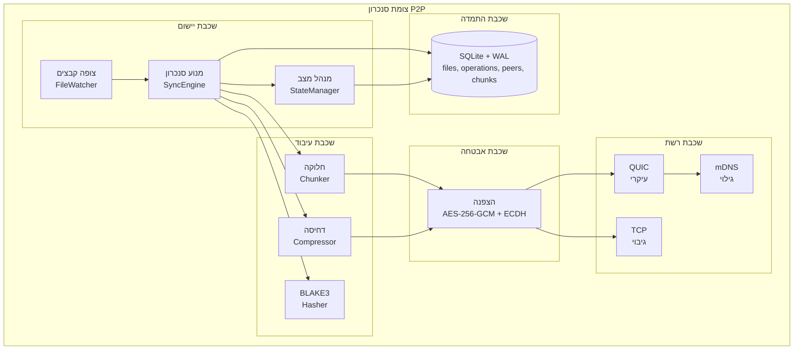
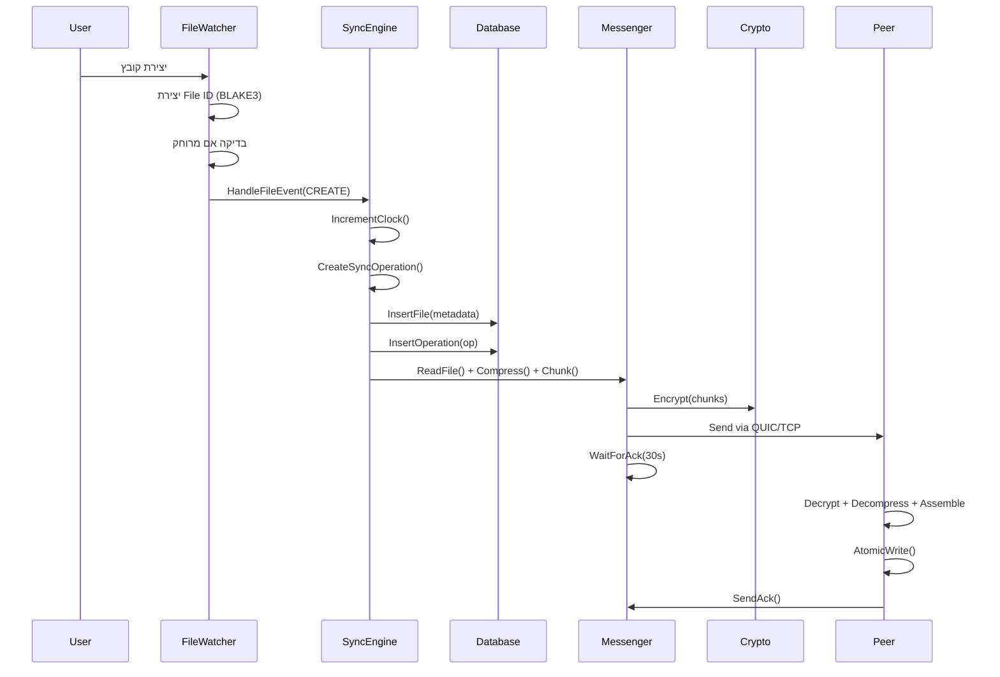

# סנכרון תיקיות P2P - מפרט פרויקט מלא

**גרסה**: 1.0.0
**עודכן לאחרונה**: ינואר 2025
**סטטוס**: יישום מוכן לייצור

מסמך זה הוא המפרט הסמכותי עבור כל פרויקט סנכרון תיקיות P2P, הכולל ארכיטקטורת מערכת, דרישות יישום, אסטרטגיית בדיקות, תקני תיעוד, ארכיטקטורת פריסה והליכים תפעוליים. הוא משמש כתכנית המלאה ליצירה מחדש או הרחבת המערכת.

---

## תוכן עניינים

1. [סקירת פרויקט](#1-סקירת-פרויקט)
2. [ארכיטקטורת מערכת](#2-ארכיטקטורת-מערכת)
3. [יישום רכיבים ליבתיים](#3-יישום-רכיבים-ליבתיים)
4. [סביבת פיתוח](#4-סביבת-פיתוח)
5. [אסטרטגיית בדיקות](#5-אסטרטגיית-בדיקות)
6. [תקני תיעוד](#6-תקני-תיעוד)
7. [צינור CI/CD](#7-צינור-cicd)
8. [ארכיטקטורת פריסה](#8-ארכיטקטורת-פריסה)
9. [ניטור ותצפית](#9-ניטור-ותצפית)
10. [יישום אבטחה](#10-יישום-אבטחה)
11. [דרישות ביצועים](#11-דרישות-ביצועים)
12. [הליכים תפעוליים](#12-הליכים-תפעוליים)
13. [בקרת איכות](#13-בקרת-איכות)
14. [מבנה פרויקט](#14-מבנה-פרויקט)

---

## 1. סקירת פרויקט

### 1.1 מטרה

סנכרון תיקיות P2P הוא מערכת מבוזרת לסנכרון קבצים עמית-לעמית המאפשרת למספר עמיתים לתחזק עותקים עקביים של תיקייה משותפת ברשת מקומית ללא דרישה לשרת מרכזי.

### 1.2 יעדי עיצוב

**יעדים עיקריים**:

- **אמינות**: אפס אובדן נתונים אפילו עם חיבורי רשת לא יציבים
- **יעילות**: תמיכה בקבצים גדולים באמצעות חלוקה חכמה (64KB-2MB)
- **אבטחה**: הצפנה מקצה לקצה עבור כל העברות הנתונים (AES-256-GCM + ECDH)
- **אוטונומיה**: גילוי עמיתים אוטומטי ברשת המקומית (mDNS + שידור UDP)
- **מדרגיות**: תמיכה בעדכונים אסינכרוניים של מספר קבצים (5-20 במקביל)
- **חוסן**: טיפול במסירת חלקים לא לפי סדר עם אימות hash
- **אינטליגנציה**: הבחנה בין שינוי שם קובץ ועריכות תוכן

**קריטריוני הצלחה**:

- זמן סנכרון <1 שנייה עבור קבצים <1MB
- תפוקה >100 MB/s ב-LAN גיגה-ביט
- תמיכה ב-50+ עמיתים במקביל
- טיפול בקבצים עד 10GB
- שיעור הצלחה של 99.9% בפעולות
- אפס לולאות סנכרון (דרישה קריטית)

### 1.3 מחסנית טכנולוגית

**טכנולוגיות ליבה**:

- **שפה**: Go 1.21+ (לביצועים, מקביליות, חוצה-פלטפורמות)
- **מסד נתונים**: SQLite 3.x עם מצב WAL (ACID, משובץ, בעל ביצועים)
- **Hashing**: BLAKE3 (מהיר פי 10 מ-SHA-256, ניתן למקבל)
- **דחיסה**: Zstandard (עיקרי), LZ4, gzip (ניתן להגדרה)
- **הצפנה**: AES-256-GCM עם החלפת מפתח ECDH Curve25519
- **תעבורה**: QUIC (עיקרי) עם גיבוי TCP
- **גילוי**: mDNS/DNS-SD + שידור UDP
- **תצפית**: OpenTelemetry (מדדים + מעקב מבוזר)

**כלי פיתוח**:

- **בנייה**: Make + מודולי Go
- **בדיקות**: חבילת testing של Go (ללא ספריות חיצוניות)
- **Linting**: golangci-lint (30+ linters מופעלים)
- **CI/CD**: GitHub Actions (10 עבודות מקבילות)
- **מכולות**: Docker + Docker Compose

---

## 2. ארכיטקטורת מערכת

### 2.1 ארכיטקטורה ברמה גבוהה



### 2.2 אחריות רכיבים ומפרטי אובייקטים

#### 2.2.1 מנוע סנכרון (`internal/sync/`)

**אחריות**:
- מתזמר את כל פעולות הסנכרון
- מתחזק שעונים וקטוריים למעקב סיבתיות
- מזהה ופותר קונפליקטים (מיזוג 3-כיווני עבור טקסט, LWW עבור בינארי)
- מתאם עם צופה מערכת קבצים ושכבת רשת
- **קריטי**: מונע לולאות סנכרון באמצעות מעקב מקור

**מפרט מלא של אובייקטים**:

```go
// Engine - מנוע הסנכרון הראשי
type Engine struct {
    peerID        string
    db            *database.DB
    messenger     Messenger
    vectorClock   *VectorClock
    fileWatcher   *filesystem.Watcher
    stateManager  *state.Manager
    chunker       *chunking.Manager
    crypto        *crypto.Engine
    config        *config.Config
    mu            sync.RWMutex
}

// מתודות ציבוריות של Engine
func NewEngine(cfg *config.Config, db *database.DB) (*Engine, error)
func (e *Engine) Start(ctx context.Context) error
func (e *Engine) Stop() error
func (e *Engine) ProcessOperation(op *SyncOperation) error
func (e *Engine) BroadcastOperation(op *SyncOperation) error
func (e *Engine) SyncWithPeer(peerID string) error
func (e *Engine) GetState() (*State, error)
func (e *Engine) HandleFileEvent(event *filesystem.Event) error
func (e *Engine) IncrementClock() uint64
func (e *Engine) GetVectorClock() *VectorClock

// SyncOperation - פעולת סנכרון
type SyncOperation struct {
    ID           string
    Type         OperationType
    FileID       string
    Path         string
    FromPath     string
    PeerID       string
    Timestamp    time.Time
    VectorClock  *VectorClock
    Checksum     string
    Size         int64
    Mode         os.FileMode
    ChunkCount   int
    Data         []byte
    Source       string
    Acknowledged bool
}

// מתודות של SyncOperation
func NewSyncOperation(opType OperationType, fileID, path string) *SyncOperation
func (so *SyncOperation) Validate() error
func (so *SyncOperation) IsLocal() bool
func (so *SyncOperation) IsRemote() bool
func (so *SyncOperation) ToProto() *pb.SyncOperation
func (so *SyncOperation) FromProto(proto *pb.SyncOperation) error

// VectorClock - שעון וקטורי למעקב סיבתיות
type VectorClock struct {
    clocks map[string]uint64
    mu     sync.RWMutex
}

// מתודות של VectorClock
func NewVectorClock() *VectorClock
func (vc *VectorClock) Increment(peerID string) uint64
func (vc *VectorClock) Update(peerID string, value uint64)
func (vc *VectorClock) Merge(other *VectorClock)
func (vc *VectorClock) CompareTo(other *VectorClock) int
func (vc *VectorClock) HappenedBefore(other *VectorClock) bool
func (vc *VectorClock) IsConcurrent(other *VectorClock) bool
func (vc *VectorClock) Clone() *VectorClock
func (vc *VectorClock) String() string
```

#### 2.2.2 שכבת רשת (`internal/network/`)

**אחריות**:
- שליחה וקבלה של הודעות עם הצפנה
- ניסיונות חוזרים (3 ניסיונות, עיכוב 1 שנייה)
- ניתוב הודעות והרכבת חלקים
- גיבוי אוטומטי מ-QUIC ל-TCP
- שירות mDNS ושידור UDP
- הגבלת רוחב פס ובקרת מקביליות

**מפרט מלא של אובייקטים**:

```go
// Messenger - מנהל שליחה וקבלה של הודעות
type Messenger struct {
    transport    Transport
    crypto       *crypto.Engine
    handlers     map[string]MessageHandler
    pendingAcks  *sync.Map
    retryPolicy  *RetryPolicy
    mu           sync.RWMutex
}

// מתודות של Messenger
func NewMessenger(transport Transport, crypto *crypto.Engine) *Messenger
func (m *Messenger) SendMessage(peerID string, msg *Message) error
func (m *Messenger) SendWithRetry(peerID string, msg *Message) error
func (m *Messenger) BroadcastMessage(msg *Message, excludePeers []string) error
func (m *Messenger) RegisterHandler(msgType string, handler MessageHandler)
func (m *Messenger) HandleIncomingMessage(msg *Message) error
func (m *Messenger) WaitForAck(msgID string, timeout time.Duration) error
func (m *Messenger) SendAck(msgID, peerID string) error
func (m *Messenger) Close() error

// Handler - מעבד הודעות נכנסות
type Handler struct {
    engine       *sync.Engine
    chunkBuffer  *chunking.BufferManager
    decompressor *compression.Decompressor
}

// מתודות של Handler
func NewHandler(engine *sync.Engine) *Handler
func (h *Handler) HandleDiscovery(msg *Message) error
func (h *Handler) HandleHandshake(msg *Message) error
func (h *Handler) HandleStateDeclaration(msg *Message) error
func (h *Handler) HandleFileRequest(msg *Message) error
func (h *Handler) HandleChunkRequest(msg *Message) error
func (h *Handler) HandleSyncOperation(msg *Message) error
func (h *Handler) HandleChunk(msg *Message) error
func (h *Handler) HandleOperationAck(msg *Message) error
func (h *Handler) HandleChunkAck(msg *Message) error
func (h *Handler) HandleHeartbeat(msg *Message) error

// Message - מבנה הודעה
type Message struct {
    ID            string
    Type          MessageType
    Timestamp     time.Time
    SenderID      string
    ReceiverID    string
    Payload       interface{}
    CorrelationID *string
    Encrypted     bool
}

// מתודות של Message
func NewMessage(msgType MessageType, senderID string) *Message
func (m *Message) SetPayload(payload interface{}) error
func (m *Message) GetPayload(target interface{}) error
func (m *Message) ToBytes() ([]byte, error)
func (m *Message) FromBytes(data []byte) error
func (m *Message) Sign(key []byte) error
func (m *Message) Verify(key []byte) error

// Transport - ממשק תעבורה
type Transport interface {
    Connect(peerID, address string) error
    Disconnect(peerID string) error
    Send(peerID string, data []byte) error
    Receive() (<-chan *Message, error)
    GetConnectedPeers() []string
    IsConnected(peerID string) bool
    Close() error
}

// QUICTransport - יישום QUIC
type QUICTransport struct {
    listener     quic.Listener
    connections  *sync.Map
    tlsConfig    *tls.Config
    quicConfig   *quic.Config
}

// מתודות של QUICTransport
func NewQUICTransport(port int, tlsCfg *tls.Config) (*QUICTransport, error)
func (qt *QUICTransport) Listen() error
func (qt *QUICTransport) Accept() (*quic.Connection, error)

// TCPTransport - יישום TCP (גיבוי)
type TCPTransport struct {
    listener    net.Listener
    connections *sync.Map
    tlsConfig   *tls.Config
}

// Discovery - גילוי עמיתים
type Discovery struct {
    mdnsService *mdns.Service
    broadcaster *UDPBroadcaster
    peerCache   *sync.Map
    interval    time.Duration
}

// מתודות של Discovery
func NewDiscovery(port int) (*Discovery, error)
func (d *Discovery) Start() error
func (d *Discovery) Stop() error
func (d *Discovery) DiscoverPeers() ([]PeerInfo, error)
func (d *Discovery) Announce() error
func (d *Discovery) RegisterPeer(peer *PeerInfo) error
func (d *Discovery) GetPeers() []PeerInfo

// FlowController - בקרת זרימה
type FlowController struct {
    rateLimiter    *rate.Limiter
    semaphore      *semaphore.Weighted
    bandwidthLimit int64
    maxConcurrent  int
}

// מתודות של FlowController
func NewFlowController(bandwidth int64, concurrent int) *FlowController
func (fc *FlowController) AcquireSlot(ctx context.Context) error
func (fc *FlowController) ReleaseSlot()
func (fc *FlowController) Wait(ctx context.Context, bytes int64) error
func (fc *FlowController) GetCurrentRate() int64
```

#### 2.2.3 שכבת מערכת קבצים (`internal/filesystem/`)

**אחריות**:
- זיהוי שינויים מבוסס fsnotify עם סינון שינויים מרחוק
- משתמש ב-file IDs יציבים (hash BLAKE3) + חלון זמן של 5 שניות
- כתיבות אטומיות (temp + rename), שימור הרשאות

**מפרט מלא של אובייקטים**:

```go
// Watcher - צופה בשינויי קבצים
type Watcher struct {
    fsWatcher    *fsnotify.Watcher
    eventChan    chan *Event
    ignorePaths  *sync.Map
    engine       *sync.Engine
    renameDetector *RenameDetector
}

// מתודות של Watcher
func NewWatcher(syncPath string) (*Watcher, error)
func (w *Watcher) Start(ctx context.Context) error
func (w *Watcher) Stop() error
func (w *Watcher) WatchPath(path string) error
func (w *Watcher) IgnorePath(path string)
func (w *Watcher) UnignorePath(path string)
func (w *Watcher) IsIgnored(path string) bool
func (w *Watcher) processEvent(event fsnotify.Event) (*Event, error)

// Event - אירוע מערכת קבצים
type Event struct {
    Type      EventType
    Path      string
    FileID    string
    Timestamp time.Time
    IsRemote  bool
}

// מתודות של Event
func (e *Event) IsCreate() bool
func (e *Event) IsWrite() bool
func (e *Event) IsDelete() bool
func (e *Event) IsRename() bool

// RenameDetector - מזהה שינויי שם
type RenameDetector struct {
    recentDeletes *sync.Map
    ttl           time.Duration
}

// מתודות של RenameDetector
func NewRenameDetector(ttl time.Duration) *RenameDetector
func (rd *RenameDetector) RecordDelete(fileID string, info DeleteInfo)
func (rd *RenameDetector) DetectRename(fileID, path string, checksum string) (bool, string)
func (rd *RenameDetector) Cleanup()

// Operations - פעולות קבצים
type Operations struct {
    basePath string
}

// מתודות של Operations
func NewOperations(basePath string) *Operations
func (o *Operations) AtomicWrite(path string, data []byte, mode os.FileMode) error
func (o *Operations) AtomicRename(oldPath, newPath string) error
func (o *Operations) Delete(path string) error
func (o *Operations) MkdirAll(path string, mode os.FileMode) error
func (o *Operations) GetFileInfo(path string) (os.FileInfo, error)
func (o *Operations) ReadFile(path string) ([]byte, error)
func (o *Operations) PreservePermissions(path string, mode os.FileMode) error
```

#### 2.2.4 שכבת אחסון (`internal/database/`)

**אחריות**:
- SQLite עם מצב WAL למקביליות
- 4 טבלאות: files, operations, peers, chunks
- אינדקסים על: timestamp, file_id, acknowledged, path, last_seen
- דחיסה תקופתית של פעולות שאושרו

**מפרט מלא של אובייקטים**:

```go
// DB - מנהל מסד נתונים
type DB struct {
    conn    *sql.DB
    mu      sync.RWMutex
    metrics *Metrics
}

// מתודות של DB
func NewDB(path string) (*DB, error)
func (db *DB) Close() error
func (db *DB) BeginTx(ctx context.Context) (*sql.Tx, error)
func (db *DB) Migrate() error
func (db *DB) Compact() error
func (db *DB) GetStats() (*Stats, error)

// פעולות קבצים
func (db *DB) InsertFile(file *File) error
func (db *DB) UpdateFile(file *File) error
func (db *DB) DeleteFile(fileID string) error
func (db *DB) GetFile(fileID string) (*File, error)
func (db *DB) GetFileByPath(path string) (*File, error)
func (db *DB) ListFiles() ([]*File, error)
func (db *DB) SearchFiles(query string) ([]*File, error)

// פעולות operations
func (db *DB) InsertOperation(op *Operation) error
func (db *DB) UpdateOperation(op *Operation) error
func (db *DB) GetOperation(opID string) (*Operation, error)
func (db *DB) ListOperations(limit, offset int) ([]*Operation, error)
func (db *DB) ListUnacknowledgedOperations() ([]*Operation, error)
func (db *DB) AcknowledgeOperation(opID string) error
func (db *DB) PurgeAcknowledgedOperations(before time.Time) error

// פעולות עמיתים
func (db *DB) InsertPeer(peer *Peer) error
func (db *DB) UpdatePeer(peer *Peer) error
func (db *DB) GetPeer(peerID string) (*Peer, error)
func (db *DB) ListPeers() ([]*Peer, error)
func (db *DB) UpdatePeerLastSeen(peerID string, timestamp time.Time) error
func (db *DB) RemoveStalePeers(ttl time.Duration) error

// פעולות חלקים
func (db *DB) InsertChunk(chunk *Chunk) error
func (db *DB) UpdateChunk(chunk *Chunk) error
func (db *DB) GetChunk(fileID string, chunkID int) (*Chunk, error)
func (db *DB) ListChunks(fileID string) ([]*Chunk, error)
func (db *DB) MarkChunkReceived(fileID string, chunkID int) error
func (db *DB) DeleteChunks(fileID string) error
```

#### 2.2.5 מערכת חלוקה (`internal/chunking/`)

**אחריות**:
- גודל חלק מסתגל (64KB מינימום, 2MB מקסימום, 512KB ברירת מחדל)
- הרכבה לא לפי סדר עם אימות hash
- ניהול באפר חלקים (64MB מקסימום לכל קובץ)

**מפרט מלא של אובייקטים**:

```go
// Chunker - מחלק קבצים לחלקים
type Chunker struct {
    minSize     int
    maxSize     int
    defaultSize int
    hasher      *hashing.Hasher
}

// מתודות של Chunker
func NewChunker(minSize, maxSize, defaultSize int) *Chunker
func (c *Chunker) ChunkFile(path string) ([]*Chunk, error)
func (c *Chunker) ChunkData(data []byte) ([]*Chunk, error)
func (c *Chunker) CalculateChunkSize(fileSize int64) int
func (c *Chunker) GetChunkCount(fileSize int64) int

// Chunk - חלק של קובץ
type Chunk struct {
    FileID     string
    ChunkID    int
    Offset     int64
    Length     int
    Hash       string
    Data       []byte
    Compressed bool
}

// מתודות של Chunk
func NewChunk(fileID string, chunkID int, offset int64) *Chunk
func (c *Chunk) Validate() error
func (c *Chunk) ComputeHash() string
func (c *Chunk) VerifyHash() bool

// Manager - מנהל חלוקה
type Manager struct {
    chunker   *Chunker
    assembler *Assembler
    buffer    *BufferManager
}

// מתודות של Manager
func NewManager(cfg *config.ChunkingConfig) *Manager
func (m *Manager) ProcessFile(path string) ([]*Chunk, error)
func (m *Manager) AssembleFile(chunks []*Chunk) ([]byte, error)
func (m *Manager) GetProgress(fileID string) float64

// Assembler - מרכיב חלקים לקובץ
type Assembler struct {
    buffers *sync.Map
    mu      sync.RWMutex
}

// מתודות של Assembler
func NewAssembler() *Assembler
func (a *Assembler) AddChunk(chunk *Chunk) error
func (a *Assembler) IsComplete(fileID string) bool
func (a *Assembler) Assemble(fileID string) ([]byte, error)
func (a *Assembler) Clear(fileID string)
func (a *Assembler) GetMissingChunks(fileID string, totalChunks int) []int

// BufferManager - מנהל באפרים
type BufferManager struct {
    buffers   *sync.Map
    maxSize   int64
    currentSize atomic.Int64
}

// מתודות של BufferManager
func NewBufferManager(maxSize int64) *BufferManager
func (bm *BufferManager) Allocate(fileID string, size int) error
func (bm *BufferManager) Free(fileID string)
func (bm *BufferManager) GetUsage() int64
func (bm *BufferManager) CanAllocate(size int) bool
```

#### 2.2.6 שכבת קריפטו (`internal/crypto/`)

**אחריות**:
- החלפת מפתח ECDH עם Curve25519
- הצפנה סימטרית AES-256-GCM
- גזירת מפתח HKDF-SHA256
- רוטציית מפתח של 24 שעות

**מפרט מלא של אובייקטים**:

```go
// Engine - מנוע הצפנה
type Engine struct {
    keychain     *Keychain
    publicKey    []byte
    privateKey   []byte
    sessionKeys  *sync.Map
    rotationInterval time.Duration
}

// מתודות של Engine
func NewEngine() (*Engine, error)
func (e *Engine) GenerateKeyPair() error
func (e *Engine) DeriveSessionKey(peerPublicKey []byte, nonce []byte) ([]byte, error)
func (e *Engine) GetSessionKey(peerID string) ([]byte, error)
func (e *Engine) RotateKeys() error
func (e *Engine) Encrypt(plaintext []byte, key []byte) (*EncryptedMessage, error)
func (e *Engine) Decrypt(encrypted *EncryptedMessage, key []byte) ([]byte, error)

// EncryptedMessage - הודעה מוצפנת
type EncryptedMessage struct {
    IV         []byte
    Ciphertext []byte
    Tag        []byte
    Algorithm  string
}

// מתודות של EncryptedMessage
func (em *EncryptedMessage) ToBytes() []byte
func (em *EncryptedMessage) FromBytes(data []byte) error
func (em *EncryptedMessage) Validate() error

// KeyExchange - החלפת מפתחות
type KeyExchange struct {
    curve      ecdh.Curve
}

// מתודות של KeyExchange
func NewKeyExchange() *KeyExchange
func (ke *KeyExchange) GenerateKeyPair() (publicKey, privateKey []byte, err error)
func (ke *KeyExchange) DeriveSharedSecret(peerPublicKey, ownPrivateKey []byte) ([]byte, error)
func (ke *KeyExchange) DeriveKey(secret, nonce []byte) ([]byte, error)

// Handshake - לחיצת יד מאובטחת
type Handshake struct {
    keyExchange *KeyExchange
    challenge   []byte
}

// מתודות של Handshake
func NewHandshake() *Handshake
func (h *Handshake) InitiateHandshake(peerID string) (*HandshakeRequest, error)
func (h *Handshake) RespondToHandshake(req *HandshakeRequest) (*HandshakeResponse, error)
func (h *Handshake) CompleteHandshake(resp *HandshakeResponse) error
func (h *Handshake) VerifyChallenge(challenge, response []byte) bool

// Keychain - ניהול מפתחות
type Keychain struct {
    keys       *sync.Map
    masterKey  []byte
    mu         sync.RWMutex
}

// מתודות של Keychain
func NewKeychain(masterKey []byte) *Keychain
func (kc *Keychain) StoreKey(peerID string, key []byte) error
func (kc *Keychain) GetKey(peerID string) ([]byte, error)
func (kc *Keychain) DeleteKey(peerID string) error
func (kc *Keychain) RotateKey(peerID string) ([]byte, error)
func (kc *Keychain) ExportKeys() ([]byte, error)
func (kc *Keychain) ImportKeys(data []byte) error
```

#### 2.2.7 שכבת דחיסה (`internal/compression/`)

**אחריות**:
- תבנית Factory לבחירת אלגוריתם
- Zstandard (רמות 1-22, ברירת מחדל 3)
- LZ4 (רמות 1-16, ברירת מחדל 1)
- Gzip (רמות 1-9, ברירת מחדל 6)
- מבוסס סף: 1MB ברירת מחדל

**מפרט מלא של אובייקטים**:

```go
// Compressor - ממשק דחיסה
type Compressor interface {
    Compress(data []byte) ([]byte, error)
    Decompress(data []byte) ([]byte, error)
    GetAlgorithm() string
    GetLevel() int
    SetLevel(level int) error
}

// Factory - יצרן דוחסים
type Factory struct {
    compressors map[string]Compressor
}

// מתודות של Factory
func NewFactory() *Factory
func (f *Factory) GetCompressor(algorithm string) (Compressor, error)
func (f *Factory) RegisterCompressor(algorithm string, comp Compressor)
func (f *Factory) ListAlgorithms() []string

// ZstdCompressor - דחיסת Zstandard
type ZstdCompressor struct {
    level int
}

// מתודות של ZstdCompressor
func NewZstdCompressor(level int) *ZstdCompressor
func (zc *ZstdCompressor) Compress(data []byte) ([]byte, error)
func (zc *ZstdCompressor) Decompress(data []byte) ([]byte, error)
func (zc *ZstdCompressor) GetAlgorithm() string
func (zc *ZstdCompressor) GetLevel() int
func (zc *ZstdCompressor) SetLevel(level int) error

// LZ4Compressor - דחיסת LZ4
type LZ4Compressor struct {
    level int
}

// מתודות של LZ4Compressor
func NewLZ4Compressor(level int) *LZ4Compressor
func (lz *LZ4Compressor) Compress(data []byte) ([]byte, error)
func (lz *LZ4Compressor) Decompress(data []byte) ([]byte, error)
func (lz *LZ4Compressor) GetAlgorithm() string
func (lz *LZ4Compressor) GetLevel() int
func (lz *LZ4Compressor) SetLevel(level int) error

// GzipCompressor - דחיסת Gzip
type GzipCompressor struct {
    level int
}

// מתודות של GzipCompressor
func NewGzipCompressor(level int) *GzipCompressor
func (gz *GzipCompressor) Compress(data []byte) ([]byte, error)
func (gz *GzipCompressor) Decompress(data []byte) ([]byte, error)
func (gz *GzipCompressor) GetAlgorithm() string
func (gz *GzipCompressor) GetLevel() int
func (gz *GzipCompressor) SetLevel(level int) error
```

#### 2.2.8 ניהול תצורה (`internal/config/`)

**מפרט מלא של אובייקטים**:

```go
// Config - תצורה ראשית
type Config struct {
    Sync          SyncConfig
    Network       NetworkConfig
    Security      SecurityConfig
    Compression   CompressionConfig
    Observability ObservabilityConfig
}

// מתודות של Config
func Load(path string) (*Config, error)
func (c *Config) Validate() error
func (c *Config) Save(path string) error
func (c *Config) Merge(other *Config) error
func (c *Config) GetDefaults() *Config

// SyncConfig - תצורת סנכרון
type SyncConfig struct {
    FolderPath            string
    ChunkSizeMin          int
    ChunkSizeMax          int
    ChunkSizeDefault      int
    MaxConcurrentTransfers int
    OperationLogSize      int
}

// NetworkConfig - תצורת רשת
type NetworkConfig struct {
    Port              int
    DiscoveryPort     int
    HeartbeatInterval time.Duration
    ConnectionTimeout time.Duration
    Peers             []string
}

// SecurityConfig - תצורת אבטחה
type SecurityConfig struct {
    KeyRotationInterval time.Duration
    EncryptionAlgorithm string
}

// CompressionConfig - תצורת דחיסה
type CompressionConfig struct {
    Enabled           bool
    FileSizeThreshold int64
    Algorithm         string
    Level             int
    ChunkCompression  bool
}

// ObservabilityConfig - תצורת תצפיתיות
type ObservabilityConfig struct {
    OtelEndpoint   string
    LogLevel       string
    MetricsEnabled bool
    TracingEnabled bool
}
```

#### 2.2.9 ניהול מצב (`internal/state/`)

**מפרט מלא של אובייקטים**:

```go
// Manager - מנהל מצב
type Manager struct {
    db             *database.DB
    engine         *sync.Engine
    loadBalancer   *LoadBalancer
}

// מתודות של Manager
func NewManager(db *database.DB, engine *sync.Engine) *Manager
func (m *Manager) DeclareState() (*StateDeclaration, error)
func (m *Manager) ReconcileState(peerState *StateDeclaration) error
func (m *Manager) GetMissingFiles(peerState *StateDeclaration) ([]string, error)
func (m *Manager) RequestMissingFiles(peerID string, fileIDs []string) error

// StateDeclaration - הצהרת מצב
type StateDeclaration struct {
    PeerID      string
    Timestamp   time.Time
    VectorClock *sync.VectorClock
    Files       []FileMetadata
}

// מתודות של StateDeclaration
func NewStateDeclaration(peerID string) *StateDeclaration
func (sd *StateDeclaration) ToProto() *pb.StateDeclaration
func (sd *StateDeclaration) FromProto(proto *pb.StateDeclaration) error

// LoadBalancer - איזון עומסים
type LoadBalancer struct {
    peerStats *sync.Map
}

// מתודות של LoadBalancer
func NewLoadBalancer() *LoadBalancer
func (lb *LoadBalancer) SelectPeer(fileID string, availablePeers []string) string
func (lb *LoadBalancer) UpdatePeerStats(peerID string, stats *PeerStats)
func (lb *LoadBalancer) GetPeerLoad(peerID string) float64
```

### 2.3 זרימת נתונים

**דיאגרמת רצף ליצירת קובץ**:



**מניעת לולאת סנכרון** (קריטי):

```go
// סמן את כל הכתיבות הנכנסות כמרוחקות
operation := FileOperation{
    Source: "remote",  // מונע שידור מחדש
    FileID: metadata.FileID,
}

// השבת זמנית את הצופה
fileWatcher.IgnorePath(metadata.Path)
defer fileWatcher.WatchPath(metadata.Path)

// כתוב קובץ אטומית
atomicWriteFile(metadata.Path, fileData)

// עדכן מסד נתונים (מסומן כמרוחק)
db.InsertFile(metadata, OperationContext{Source: "remote"})

// תעד אך אל תשדר
logOperation(operation)
```

### 2.4 פרוטוקול רשת

**סוגי הודעות** (13 סוגים):

- **בקרה**: discovery, discovery_response, handshake, handshake_ack, handshake_complete, state_declaration, file_request, chunk_request, operation_ack, chunk_ack, heartbeat
- **נתונים**: sync_operation, chunk

**פורמט הודעה**:

```go
type Message struct {
    ID            string      // UUID v4
    Type          string      // Message type enum
    Timestamp     int64       // Unix milliseconds
    SenderID      string      // Peer UUID
    Payload       interface{} // Type-specific data
    CorrelationID *string     // Request/response matching
}
```

**מנגנוני אמינות**:

- כל ההודעות הקריטיות דורשות ACK תוך 30 שניות
- 3 ניסיונות חוזרים עם עיכוב של שנייה (exponential backoff)
- מספרי רצף לביטול כפילויות
- אימות hash ברמת החלק וברמת הקובץ (BLAKE3)

---

## 3. יישום רכיבים ליבתיים

### 3.1 זיהוי קבצים

**יצירת File ID יציב**:

```go
// עבור קבצים לא ריקים
fileID = BLAKE3(first_64KB + initial_size + creation_time)

// עבור קבצים ריקים
fileID = BLAKE3(creation_time + initial_size + peer_id)

// נשמר ב-xattr (Linux/macOS) או DB מטא-דטה (Windows)
xattr.Set(path, "user.p2p_sync.file_id", base64.Encode(fileID))
```

**אלגוריתם זיהוי שינוי שם**:

```go
// במחיקת קובץ: שמור ב-recent_deletes (TTL: 5 שניות)
recentDeletes[fileID] = DeleteInfo{
    Checksum: fileChecksum,
    Size: fileSize,
    Mtime: mtime,
    DeletedAt: time.Now(),
}

// ביצירת קובץ: בדוק שינוי שם
if deleteInfo, exists := recentDeletes[fileID]; exists {
    if deleteInfo.Checksum == newChecksum {
        // פעולת RENAME
        return OpRename
    } else {
        // DELETE + CREATE (קובץ נערך)
        return OpDelete, OpCreate
    }
}
return OpCreate
```

### 3.2 פתרון קונפליקטים

**זיהוי**:

```go
// קונפליקט אם שעונים וקטוריים מתרחשים במקביל
func detectConflict(vcA, vcB VectorClock) bool {
    aBeforeB := vcA.CompareTo(vcB) == -1
    bBeforeA := vcB.CompareTo(vcA) == -1
    return !aBeforeB && !bBeforeA  // Concurrent
}
```

**אסטרטגיית פתרון**:

```go
func resolveConflict(base, branchA, branchB File) (File, error) {
    if isTextFile(base) {
        // מיזוג 3-כיווני עם אלגוריתם diff3
        return threeWayMerge(base, branchA, branchB)
    } else {
        // Last Write Wins עבור קבצים בינאריים
        if branchA.Timestamp > branchB.Timestamp {
            return branchA, nil
        } else if branchB.Timestamp > branchA.Timestamp {
            return branchB, nil
        } else {
            // שובר שוויון: peer ID קטן יותר לקסיקוגרפית מנצח
            if branchA.PeerID < branchB.PeerID {
                return branchA, nil
            }
            return branchB, nil
        }
    }
}
```

### 3.3 סכמת מסד נתונים

**סכמת SQLite מלאה**:

```sql
-- הפעלת מצב WAL למקביליות
PRAGMA journal_mode=WAL;
PRAGMA synchronous=NORMAL;
PRAGMA cache_size=-64000;  -- מטמון 64MB
PRAGMA temp_store=MEMORY;

-- טבלת קבצים
CREATE TABLE files (
  file_id TEXT PRIMARY KEY,
  path TEXT NOT NULL UNIQUE,
  checksum TEXT NOT NULL,
  size INTEGER NOT NULL,
  mtime REAL NOT NULL,
  mode INTEGER,
  peer_id TEXT NOT NULL,
  vector_clock TEXT NOT NULL,
  compressed INTEGER DEFAULT 0,
  original_size INTEGER,
  compression_algorithm TEXT,
  created_at REAL DEFAULT (unixepoch()),
  updated_at REAL DEFAULT (unixepoch())
);

-- יומן פעולות
CREATE TABLE operations (
  sequence INTEGER PRIMARY KEY AUTOINCREMENT,
  operation_id TEXT UNIQUE NOT NULL,
  timestamp REAL NOT NULL,
  operation_type TEXT NOT NULL,
  peer_id TEXT NOT NULL,
  vector_clock TEXT NOT NULL,
  acknowledged INTEGER DEFAULT 0,
  persisted INTEGER DEFAULT 0,
  file_id TEXT,
  path TEXT NOT NULL,
  from_path TEXT,
  checksum TEXT,
  size INTEGER,
  mtime REAL,
  mode INTEGER,
  chunk_count INTEGER DEFAULT 0,
  data BLOB,
  compressed INTEGER DEFAULT 0,
  original_size INTEGER,
  compression_algorithm TEXT,
  FOREIGN KEY (file_id) REFERENCES files(file_id)
);

-- טבלת עמיתים
CREATE TABLE peers (
  peer_id TEXT PRIMARY KEY,
  address TEXT,
  port INTEGER,
  public_key TEXT,
  certificate TEXT,
  capabilities TEXT,
  last_seen REAL,
  connection_state TEXT DEFAULT 'disconnected',
  trust_level TEXT DEFAULT 'unknown',
  created_at REAL DEFAULT (unixepoch())
);

-- טבלת חלקים
CREATE TABLE chunks (
  file_id TEXT NOT NULL,
  chunk_id INTEGER NOT NULL,
  chunk_hash TEXT NOT NULL,
  offset INTEGER NOT NULL,
  length INTEGER NOT NULL,
  received INTEGER DEFAULT 0,
  received_at REAL,
  PRIMARY KEY (file_id, chunk_id),
  FOREIGN KEY (file_id) REFERENCES files(file_id)
);

-- אינדקסי ביצועים
CREATE INDEX idx_operations_timestamp ON operations(timestamp);
CREATE INDEX idx_operations_file_id ON operations(file_id);
CREATE INDEX idx_operations_acknowledged ON operations(acknowledged);
CREATE INDEX idx_files_path ON files(path);
CREATE INDEX idx_peers_last_seen ON peers(last_seen);
CREATE INDEX idx_chunks_file_id ON chunks(file_id);

-- טבלת תצורה
CREATE TABLE config (
  key TEXT PRIMARY KEY,
  value TEXT NOT NULL,
  updated_at REAL DEFAULT (unixepoch())
);
```

### 3.4 סכמת תצורה

**מבנה תצורה מלא**:

```yaml
sync:
  folder_path: "/path/to/sync" # נדרש
  chunk_size_min: 65536 # 64KB, טווח: 4KB-1MB
  chunk_size_max: 2097152 # 2MB, טווח: 1MB-10MB
  chunk_size_default: 524288 # 512KB
  max_concurrent_transfers: 5 # טווח: 1-20
  operation_log_size: 10000 # רשומות מקסימליות לפני דחיסה

network:
  port: 8080 # טווח: 1024-65535
  discovery_port: 8081 # טווח: 1024-65535
  heartbeat_interval: 30 # שניות
  connection_timeout: 60 # שניות
  peers: [] # אופציונלי: ["ip:port", ...]

security:
  key_rotation_interval: 86400 # 24 שעות, טווח: 1h-7days
  encryption_algorithm: "aes-256-gcm" # קבוע

compression:
  enabled: true
  file_size_threshold: 1048576 # 1MB, טווח: 1KB-1GB
  algorithm: "zstd" # zstd|lz4|gzip|none
  level: 3 # ספציפי לאלגוריתם
  chunk_compression: true

observability:
  otel_endpoint: "" # אופציונלי
  log_level: "info" # debug|info|warn|error
  metrics_enabled: true
  tracing_enabled: true
```

**כללי ולידציה**:

- `folder_path`: חייב להתקיים ולהיות ניתן לכתיבה
- `chunk_size_default`: חייב להיות בין min ו-max
- `compression.level`: מאומת לפי אלגוריתם (zstd: 1-22, lz4: 1-16, gzip: 1-9)
- פורטים: לא יכולים להתנגש, חייבים להיות זמינים

---

## 4. סביבת פיתוח

### 4.1 דרישות מוקדמות

**נדרש**:

- Go 1.21+ (עבור generics, שיפור בהסקת סוגים)
- Git 2.30+ (לבקרת גרסאות)
- Make 4.0+ (אוטומציית בנייה)
- SQLite 3.35+ (מובנה, אין צורך בהתקנה נפרדת)

**מומלץ**:

- golangci-lint 1.55+ (איכות קוד)
- Docker 20.10+ (בדיקות מכולה)
- VS Code עם הרחבת Go (IDE)
- delve (מנפה שגיאות Go)

### 4.2 מבנה פרויקט

```
p2p-folder-sync/
├── cmd/p2p-sync/
│   └── main.go                          # נקודת כניסה
├── internal/                            # חבילות פרטיות
│   ├── sync/                            # מנוע סנכרון
│   │   ├── engine.go
│   │   ├── messenger.go
│   │   ├── operation.go
│   │   └── conflict/                    # פתרון קונפליקטים
│   │       ├── resolver.go
│   │       └── merge.go
│   ├── network/                         # שכבת רשת
│   │   ├── handler.go
│   │   ├── messenger.go
│   │   ├── transport/
│   │   │   ├── quic.go
│   │   │   ├── tcp.go
│   │   │   └── fallback.go
│   │   ├── discovery/
│   │   │   └── mdns.go
│   │   ├── messages/
│   │   │   └── types.go
│   │   ├── connection/
│   │   │   └── manager.go
│   │   └── flowcontrol/
│   │       └── ratelimiter.go
│   ├── database/                        # התמדה SQLite
│   │   ├── db.go
│   │   ├── files.go
│   │   ├── chunks.go
│   │   ├── operations.go
│   │   ├── peers.go
│   │   └── migrations.go
│   ├── filesystem/                      # פעולות קבצים
│   │   ├── watcher.go
│   │   ├── operations.go
│   │   └── rename_detector.go
│   ├── hashing/                         # BLAKE3 hashing
│   │   ├── blake3.go
│   │   └── fileid.go
│   ├── chunking/                        # חלוקת קבצים
│   │   ├── chunker.go
│   │   ├── manager.go
│   │   ├── buffer.go
│   │   └── assembler.go
│   ├── crypto/                          # הצפנה
│   │   ├── encryption.go
│   │   ├── keyexchange.go
│   │   ├── handshake.go
│   │   ├── auth.go
│   │   └── keychain.go
│   ├── compression/                     # דחיסה
│   │   ├── compressor.go
│   │   ├── factory.go
│   │   ├── zstd.go
│   │   ├── lz4.go
│   │   └── gzip.go
│   ├── config/                          # תצורה
│   │   ├── config.go
│   │   └── loader.go
│   ├── monitoring/                      # מדדים
│   │   ├── metrics.go
│   │   └── server.go
│   ├── observability/                   # תיעוד ומעקב
│   │   └── logger.go
│   └── state/                           # ניהול מצב
│       ├── declaration.go
│       ├── reconciliation.go
│       └── loadbalance.go
├── test/                                # חבילות בדיקה
│   ├── unit/                            # בדיקות יחידה (24 קבצים)
│   │   ├── chunking/
│   │   ├── compression/
│   │   ├── config/
│   │   ├── crypto/
│   │   ├── database/
│   │   ├── filesystem/
│   │   ├── flowcontrol/
│   │   ├── hashing/
│   │   ├── monitoring/
│   │   ├── network/
│   │   │   ├── messenger_test.go
│   │   │   └── handler_test.go
│   │   ├── observability/
│   │   ├── state/
│   │   ├── sync/
│   │   └── transport/
│   ├── integration/                     # בדיקות אינטגרציה (8 קבצים)
│   │   ├── basic_test.go
│   │   ├── system_test.go
│   │   ├── performance_test.go
│   │   ├── failure_test.go
│   │   ├── edge_cases_test.go
│   │   ├── fileid_persistence_test.go
│   │   ├── database_corruption_test.go
│   │   └── docker_system_test.go
│   ├── system/                          # בדיקות E2E (17 קבצים)
│   │   ├── p2p_sync_test.go
│   │   ├── conflict_resolution_test.go
│   │   ├── encryption_test.go
│   │   ├── rename_detection_test.go
│   │   ├── network_resilience_test.go
│   │   ├── operation_replay_test.go
│   │   ├── multi_peer_test.go
│   │   ├── sync_loop_prevention_test.go
│   │   ├── load_balancing_test.go
│   │   ├── integration_e2e_test.go
│   │   └── [עוזרי בדיקה: 7 קבצים]
│   └── run_system_tests.sh             # מריץ בדיקות
├── config/
│   └── config.yaml                      # דוגמת תצורה
├── docs/                                # תיעוד
│   ├── README.md
│   ├── architecture/
│   ├── guides/
│   │   ├── installation.md
│   │   ├── configuration.md
│   │   └── performance.md
│   └── api/
├── scripts/
│   └── install-pre-commit-hook.sh
├── .github/workflows/
│   ├── ci.yml                           # צינור CI
│   └── release.yml                      # אוטומציית שחרור
├── .golangci.yml                        # תצורת Linter
├── .pre-commit-hook.sh                  # בדיקות לפני commit
├── .gitignore
├── Dockerfile                           # בנייה רב-שלבית
├── docker-compose.yml                   # הגדרת 3 עמיתים
├── Makefile                             # אוטומציית בנייה
├── go.mod                               # תלויות Go
├── go.sum                               # checksums תלויות
├── README.md                            # סקירת פרויקט
├── DEVELOPER.md                         # מדריך מפתח
├── API_REFERENCE.md                     # תיעוד API
├── ARCHITECTURE.md                      # תיעוד ארכיטקטורה
├── DEPLOYMENT.md                        # מדריך פריסה
├── TROUBLESHOOTING.md                   # מדריך פתרון בעיות
├── spec.md                              # מפרט מקורי
├── IMPLEMENTATION_REPORT.md             # סטטוס יישום
└── PROJECT_SPECIFICATION.md             # קובץ זה
```

### 4.3 מערכת בנייה

**יעדי Makefile**:

```makefile
# יעדים ראשיים
.PHONY: all build test clean

# בנה קובץ בינארי
build:
	@echo "Building p2p-sync..."
	@mkdir -p bin
	go build -o bin/p2p-sync ./cmd/p2p-sync

# הרץ את כל הבדיקות
test:
	P2P_TESTING_MODE=true go test -v -race ./...

# צור כיסוי
test-coverage:
	go test -v -race -coverprofile=coverage.out ./...
	go tool cover -html=coverage.out -o coverage.html

# פרמט קוד
fmt:
	gofmt -w -s .

# הרץ linter
lint:
	golangci-lint run --timeout=5m ./...

# בדוק הכל (fmt + lint + test)
check: fmt lint test

# נקה artifacts בנייה
clean:
	rm -rf bin/ coverage.out coverage.html

# בנייה Docker
docker-build:
	docker build -t p2p-sync:latest .

# בדיקה Docker
docker-test:
	docker-compose -f docker-compose.yml up --abort-on-container-exit
```

### 4.4 תצורת IDE

**VS Code settings.json**:

```json
{
  "go.useLanguageServer": true,
  "go.lintTool": "golangci-lint",
  "go.lintOnSave": "package",
  "go.formatTool": "gofmt",
  "go.formatOnSave": true,
  "go.testFlags": ["-v", "-race"],
  "go.testTimeout": "60s",
  "go.coverOnSave": true,
  "editor.formatOnSave": true,
  "files.eol": "\\n"
}
```

**VS Code launch.json**:

```json
{
  "version": "0.2.0",
  "configurations": [
    {
      "name": "Launch P2P Sync",
      "type": "go",
      "request": "launch",
      "mode": "debug",
      "program": "${workspaceFolder}/cmd/p2p-sync",
      "env": {
        "P2P_SYNC_FOLDER": "/tmp/test-sync",
        "LOG_LEVEL": "debug"
      },
      "args": ["-config", "config/config.yaml"]
    }
  ]
}
```

---

## 5. אסטרטגיית בדיקות

### 5.1 פילוסופיית בדיקות

**עקרונות**:

- בדוק התנהגות, לא יישום
- המתנה מונחית אירועים, לא מבוססת sleep
- כיסוי מקיף של נתיבי שגיאות
- בדיקות יחידה מהירות (<100ms), בדיקות אינטגרציה ארוכות יותר (<5s), E2E מלא (<60s)
- ביצוע בדיקות מקבילי כאשר אפשרי
- אין בדיקות תלויות זו בזו

**דרישות כיסוי**:

- כללי: >70% (נאכף על ידי CI)
- נתיבים קריטיים: >90% (מנוע סנכרון, messenger רשת, פעולות קבצים)
- קוד חדש: 100% (כל התכונות החדשות חייבות לכלול בדיקות)

### 5.2 ארגון בדיקות

**מבנה בדיקות** (3 רמות):

1. **בדיקות יחידה** (`test/unit/`, 24 קבצים, 189+ בדיקות):

   - מהירות, בדיקות רכיבים מבודדות
   - mock תלויות חיצוניות
   - התמקדות בפונקציה/מתודה בודדת
   - יעד: <100ms לכל בדיקה

2. **בדיקות אינטגרציה** (`test/integration/`, 8 קבצים, 19 בדיקות):

   - אינטראקציה בין-רכיבית
   - מסד נתונים אמיתי (בזיכרון)
   - בודק גבולות רכיבים
   - יעד: <5s לכל בדיקה

3. **בדיקות מערכת** (`test/system/`, 17 קבצים, 24+ בדיקות):
   - תרחישי end-to-end
   - מחזור חיים מלא של יישום
   - רשת אמיתית או mock
   - יעד: <30s לכל בדיקה

### 5.3 דרישות בדיקה

**דרישות בדיקת יחידה**:

```go
// מבנה בדיקה נדרש
func TestComponentName_Method_Scenario(t *testing.T) {
    // Arrange: הגדר נתוני בדיקה
    input := createTestData()

    // Act: בצע פונקציונליות
    result, err := ComponentMethod(input)

    // Assert: אמת ציפיות
    if err != nil {
        t.Errorf("Expected no error, got: %v", err)
    }
    if result != expected {
        t.Errorf("Expected %v, got %v", expected, result)
    }
}
```

**כיסוי בדיקות נדרש**:

- ✅ פעולה רגילה (נתיב שמח)
- ✅ תנאי שגיאה (כל החזרות שגיאה)
- ✅ תנאי גבול (ריק, מקסימום, overflow)
- ✅ גישה מקבילית (אם רלוונטי)
- ✅ ניקוי משאבים (הצהרות defer)

**כלי עזר לבדיקות**:

```go
// EventDrivenWaiter (test/system/test_helpers.go)
type EventDrivenWaiter struct {
    Timeout      time.Duration  // ברירת מחדל: 30s
    PollInterval time.Duration  // ברירת מחדל: 100ms
}

func (w *EventDrivenWaiter) WaitForFileSync(path string, expectedContent string) error

// InMemoryMessenger (internal/sync/messenger.go)
type InMemoryMessenger struct {
    peers map[string]*Engine
}
func NewInMemoryMessenger() *InMemoryMessenger

// MockTransport (test/unit/network/messenger_test.go)
type MockTransport struct {
    sentMessages map[string][]*Message
    sendError    error
}
```

### 5.4 תרחישי בדיקה קריטיים

**בדיקות חובה** (לפני כל שחרור):

1. **מניעת לולאת סנכרון** (test/system/sync_loop_prevention_test.go):

   - אמת שכתיבות מרוחקות לא מפעילות סנכרון מחדש
   - בדוק עם 3+ עמיתים
   - עקוב אחרי לולאות אינסופיות

2. **סנכרון רב-עמיתים** (test/system/multi_peer_test.go):

   - 3 עמיתים, צור קובץ בעמית 1
   - אמת מופיע בעמיתים 2 ו-3 תוך 5 שניות
   - אמת התוכן תואם בדיוק

3. **פתרון קונפליקטים** (test/system/conflict_resolution_test.go):

   - 2 עמיתים עורכים אותו קובץ במקביל
   - אמת מיזוג 3-כיווני עבור קבצי טקסט
   - אמת LWW עבור קבצים בינאריים

4. **חוסן רשת** (test/system/network_resilience_test.go):

   - ניתוק במהלך העברה
   - אמת המשכיות מהחלק האחרון
   - אין אובדן נתונים או שחיתות

5. **הצפנה End-to-End** (test/system/encryption_test.go):

   - אמת שכל הנתונים מוצפנים בחוט
   - אמת שרוטציית מפתח עובדת
   - אמת הקמת מפתח סשן

6. **זיהוי שינוי שם** (test/system/rename_detection_test.go):

   - שנה שם קובץ בעמית 1
   - אמת מזוהה כשינוי שם (לא delete+create)
   - אמת נכון בעמית 2

7. **איזון עומסים** (test/system/load_balancing_test.go):
   - עמית חדש מצטרף עם 3 עמיתים קיימים
   - אמת קבצים מתבקשים ממקורות מרובים
   - אין בקשות כפולות

### 5.5 ביצוע בדיקות

**בדיקות מקומיות**:

```bash
# כל הבדיקות
make test

# יחידה בלבד (מהיר)
./test/run_system_tests.sh --unit-only

# אינטגרציה בלבד
./test/run_system_tests.sh --integration-only

# דלג על בדיקות Docker
./test/run_system_tests.sh --fast

# עם כיסוי
make test-coverage
```

**בדיקות CI** (אוטומטי בכל push/PR):

- 10 עבודות מקבילות
- מטריצה: Go 1.21, 1.22
- פלטפורמות: Linux, macOS, Windows
- סף כיסוי: 70%
- כל הבדיקות חייבות לעבור

---

## 6. תקני תיעוד

### 6.1 תיעוד נדרש

**פונה משתמש** (5 קבצים):

1. **README.md**: סקירת פרויקט, התחלה מהירה, תכונות
2. **API_REFERENCE.md**: התייחסות תצורה מלאה, פרוטוקולים, מדדים
3. **DEPLOYMENT.md**: מדריך פריסה לייצור
4. **TROUBLESHOOTING.md**: בעיות נפוצות, אבחון
5. **docs/guides/**: התקנה, תצורה, ביצועים

**פונה מפתח** (2 קבצים):

1. **DEVELOPER.md**: סביבת פיתוח, בדיקות, זרימת עבודה
2. **ARCHITECTURE.md**: עיצוב מערכת, רכיבים, החלטות

**פונה פרויקט** (3 קבצים):

1. **spec.md**: מפרט מקורי
2. **IMPLEMENTATION_REPORT.md**: סטטוס יישום
3. **PROJECT_SPECIFICATION.md**: מפרט מלא זה

### 6.2 סגנון תיעוד

**תקנים**:

- השתמש ב-Markdown לכל התיעוד
- כלול דוגמאות קוד עם הדגשת תחביר
- הוסף דיאגרמות למושגים מורכבים (Mermaid לניידות)
- קשר בין מסמכים קשורים
- שמור על שפה ברורה ותמציתית
- כלול סעיפי פתרון בעיות
- הוסף חותמות זמן (עודכן לאחרונה: חודש שנה)

**תיעוד קוד**:

```go
// Package sync מיישם את מנוע הסנכרון הליבתי עבור סנכרון תיקיות P2P.
//
// מנוע הסנכרון מתזמר פעולות קבצים, מתחזק שעונים וקטוריים למעקב
// סיבתיות, ומתאם פתרון קונפליקטים בין עמיתים.
package sync

// Engine מתאם פעולות סנכרון קבצים עמית-לעמית.
// הוא מתחזק מצב, מעבד פעולות נכנסות, ומשדר
// שינויים מקומיים לעמיתים מחוברים.
//
// Thread-safe: כל המתודות הציבוריות יכולות להיקרא במקביל.
type Engine struct {
    peerID      string
    db          *database.DB
    // ...
}

// ProcessOperation מטפל בפעולת סנכרון נכנסת מעמית.
// הוא מאמת את הפעולה, מיישם אותה למצב המקומי, ו
// משדר אותה לעמיתים אחרים אם נדרש.
//
// פרמטרים:
//   - op: פעולת הסנכרון לעיבוד
//
// מחזיר שגיאה אם הפעולה לא תקינה או לא ניתן ליישמה.
func (e *Engine) ProcessOperation(op *SyncOperation) error {
    // יישום
}
```

---

## 7. צינור CI/CD

### 7.1 אינטגרציה מתמשכת

**זרימת עבודה GitHub Actions** (`.github/workflows/ci.yml`):

**עבודות** (10 עבודות מקבילות):

1. **Lint** (golangci-lint, בדיקת gofmt)
2. **בדיקות יחידה** (מטריצה: Go 1.21, 1.22)
3. **בדיקות אינטגרציה** (עם רשת אמיתית)
4. **בדיקות מערכת** (E2E מלא)
5. **כיסוי** (סף 70%, העלה ל-Codecov)
6. **בנייה** (6 פלטפורמות: Linux/macOS/Windows × amd64/arm64)
7. **Docker** (בנייה רב-שלבית)
8. **אבטחה** (סורק gosec)
9. **תלויות** (govulncheck, go mod verify)
10. **כל הבדיקות** (סטטוס מצטבר)

**תנאי הפעלה**:

- Push לענפים main/develop
- כל pull requests
- הפעלת זרימת עבודה ידנית

**בדיקות נדרשות** (חייבות לעבור לפני מיזוג):

- ✅ כל ה-linters עוברים
- ✅ כל הבדיקות עוברות
- ✅ כיסוי ≥70%
- ✅ סריקת אבטחה נקייה
- ✅ אין תלויות פגיעות
- ✅ כל הפלטפורמות נבנות בהצלחה

### 7.2 פריסה מתמשכת

**זרימת עבודה שחרור** (`.github/workflows/release.yml`):

**הפעלה**: תג Git תואם `v*` (לדוגמה, `v1.0.0`)

**שלבים**:

1. הרץ חבילת בדיקות מלאה
2. בנה קבצים בינאריים עבור 5 פלטפורמות
3. צור סכומי ביקורת SHA256
4. צור שחרור GitHub עם הערות
5. העלה קבצים בינאריים כנכסי שחרור
6. בנה תמונת Docker רב-ארכיטקטורה (amd64, arm64)
7. דחוף ל-GitHub Container Registry (ghcr.io)

**artifacts שחרור**:

- `p2p-sync-linux-amd64`
- `p2p-sync-linux-arm64`
- `p2p-sync-darwin-amd64`
- `p2p-sync-darwin-arm64`
- `p2p-sync-windows-amd64.exe`
- `checksums.txt`
- תמונת Docker: `ghcr.io/yourorg/p2p-sync:latest` ו-`ghcr.io/yourorg/p2p-sync:v1.0.0`

### 7.3 קרסי Pre-commit

**בדיקות איכות מקומיות** (`.pre-commit-hook.sh`):

**בדיקות** (רץ לפני כל commit):

1. פרמוט קוד (gofmt)
2. Linter (golangci-lint)
3. בדיקות יחידה (תת-קבוצה מהירה)
4. בעיות נפוצות (TODO/FIXME, הדפסות debug)
5. אימות בנייה

**התקנה**:

```bash
./scripts/install-pre-commit-hook.sh
```

**דילוג (חירום בלבד)**:

```bash
git commit --no-verify
```

---

## 8. ארכיטקטורת פריסה

### 8.1 אפשרויות פריסה

**אפשרות 1: קובץ בינארי עצמאי** (הפשוט ביותר):

- הורד קובץ בינארי לפלטפורמה
- צור קובץ תצורה
- הרץ כשירות מערכת

**אפשרות 2: שירות Systemd** (ייצור Linux):

- התקן קובץ בינארי ל-`/usr/local/bin/`
- צור קובץ יחידת systemd
- הפעל והתחל שירות

**אפשרות 3: מכולת Docker** (נייד):

- צומת יחיד: פקודת Docker run
- רב-צומתי: Docker Compose
- תזמור: Kubernetes StatefulSet

**אפשרות 4: Kubernetes** (בקנה מידה גדול):

- StatefulSet עם אמצעי אחסון מתמידים
- שירות לגילוי עמיתים
- ConfigMap לתצורה

### 8.2 דרישות ייצור

**חומרה**:

- CPU: 2+ ליבות (4+ מומלץ)
- RAM: 2GB מינימום (4GB מומלץ)
- דיסק: SSD, 10GB + גודל תיקיית סנכרון
- רשת: 100 Mbps מינימום (1 Gbps מומלץ)

**תוכנה**:

- OS: Linux (Ubuntu 20.04+, CentOS 8+, Debian 11+)
- Kernel: 4.19+ (לתמיכת QUIC)
- Firewall: אפשר TCP 8080, UDP 8081

**רשת**:

- פורט TCP 8080 פתוח (תעבורת סנכרון)
- פורט UDP 8081 פתוח (גילוי)
- עיכוב נמוך (<100ms מומלץ)
- חיבור יציב (אובדן מנות <1%)

### 8.3 תצורת שירות Systemd

**קובץ שירות** (`/etc/systemd/system/p2p-sync.service`):

```ini
[Unit]
Description=שירות סנכרון תיקיות P2P
After=network-online.target
Wants=network-online.target

[Service]
Type=simple
User=p2psync
Group=p2psync
WorkingDirectory=/var/lib/p2p-sync
ExecStart=/usr/local/bin/p2p-sync -config /etc/p2p-sync/config.yaml
Restart=on-failure
RestartSec=10s
StartLimitBurst=3
StartLimitInterval=60s
LimitNOFILE=65536
MemoryLimit=2G
CPUQuota=200%
NoNewPrivileges=true
PrivateTmp=true
ProtectSystem=strict
ReadWritePaths=/var/lib/p2p-sync
StandardOutput=journal
StandardError=journal

[Install]
WantedBy=multi-user.target
```

### 8.4 תצורת Docker

**Dockerfile** (בנייה רב-שלבית):

```dockerfile
# שלב בנייה
FROM golang:1.21-alpine AS builder
WORKDIR /app
COPY go.mod go.sum ./
RUN go mod download
COPY . .
RUN CGO_ENABLED=0 GOOS=linux go build \
    -ldflags="-s -w" \
    -o p2p-sync ./cmd/p2p-sync

# שלב runtime
FROM ubuntu:22.04
RUN apt-get update && apt-get install -y \
    ca-certificates \
    && rm -rf /var/lib/apt/lists/*
COPY --from=builder /app/p2p-sync /usr/local/bin/p2p-sync
EXPOSE 8080 8081
HEALTHCHECK --interval=30s --timeout=10s \
  CMD curl -f http://localhost:9090/metrics || exit 1
CMD ["p2p-sync"]
```

**docker-compose.yml** (הגדרת 3 עמיתים):

```yaml
version: "3.8"

services:
  peer-alpha:
    build: .
    volumes:
      - ./sync-alpha:/app/sync
      - p2p-alpha-db:/app/data
    ports:
      - "8080:8080"
      - "8081:8081/udp"
    environment:
      P2P_SYNC_FOLDER: /app/sync
      PEERS: peer-beta:8080,peer-gamma:8080
    networks:
      - p2p-network

  peer-beta:
    build: .
    volumes:
      - ./sync-beta:/app/sync
      - p2p-beta-db:/app/data
    ports:
      - "8082:8080"
      - "8083:8081/udp"
    environment:
      P2P_SYNC_FOLDER: /app/sync
      PEERS: peer-alpha:8080,peer-gamma:8080
    networks:
      - p2p-network

  peer-gamma:
    build: .
    volumes:
      - ./sync-gamma:/app/sync
      - p2p-gamma-db:/app/data
    ports:
      - "8084:8080"
      - "8085:8081/udp"
    environment:
      P2P_SYNC_FOLDER: /app/sync
      PEERS: peer-alpha:8080,peer-beta:8080
    networks:
      - p2p-network

volumes:
  p2p-alpha-db:
  p2p-beta-db:
  p2p-gamma-db:

networks:
  p2p-network:
    driver: bridge
```

### 8.5 תצורת Kubernetes

**StatefulSet**:

```yaml
apiVersion: apps/v1
kind: StatefulSet
metadata:
  name: p2p-sync
spec:
  serviceName: p2p-sync
  replicas: 3
  selector:
    matchLabels:
      app: p2p-sync
  template:
    metadata:
      labels:
        app: p2p-sync
    spec:
      containers:
        - name: p2p-sync
          image: ghcr.io/yourorg/p2p-sync:latest
          ports:
            - containerPort: 8080
              name: sync
            - containerPort: 8081
              name: discovery
              protocol: UDP
            - containerPort: 9090
              name: metrics
          volumeMounts:
            - name: sync-data
              mountPath: /app/sync
            - name: db-data
              mountPath: /app/data
          env:
            - name: P2P_SYNC_FOLDER
              value: "/app/sync"
            - name: POD_NAME
              valueFrom:
                fieldRef:
                  fieldPath: metadata.name
          resources:
            limits:
              cpu: "2"
              memory: "2Gi"
            requests:
              cpu: "1"
              memory: "1Gi"
          livenessProbe:
            httpGet:
              path: /metrics
              port: 9090
            initialDelaySeconds: 30
            periodSeconds: 10
  volumeClaimTemplates:
    - metadata:
        name: sync-data
      spec:
        accessModes: ["ReadWriteOnce"]
        resources:
          requests:
            storage: 50Gi
    - metadata:
        name: db-data
      spec:
        accessModes: ["ReadWriteOnce"]
        resources:
          requests:
            storage: 10Gi
```

---

## 9. ניטור ותצפית

### 9.1 מדדים

**מדדי OpenTelemetry** (פורמט Prometheus ב-`:9090/metrics`):

**מדדי סנכרון**:

- `sync_operations_total{type, peer_id}` - Counter
- `sync_operation_duration_seconds{type}` - Histogram
- `sync_file_transfer_bytes{direction, peer_id}` - Counter
- `sync_active_transfers` - Gauge
- `sync_operation_errors_total{type, error}` - Counter

**מדדי דחיסה**:

- `compression_files_compressed_total{algorithm}` - Counter
- `compression_bytes_saved_total{algorithm}` - Counter
- `compression_ratio{algorithm}` - Histogram
- `compression_duration_seconds{operation, algorithm}` - Histogram

**מדדי רשת**:

- `network_connections_active` - Gauge
- `network_message_latency_seconds{type}` - Histogram
- `network_chunk_retransmissions_total{peer_id}` - Counter
- `network_messages_sent_total{type, peer_id}` - Counter
- `network_messages_received_total{type, peer_id}` - Counter

**מדדי משאבים**:

- `resource_memory_bytes{type}` - Gauge
- `resource_cpu_usage_ratio` - Gauge
- `resource_disk_usage_bytes{path}` - Gauge
- `resource_bandwidth_bytes_per_second{direction}` - Gauge

### 9.2 תיעוד

**תיעוד JSON מובנה**:

```json
{
  "timestamp": "2025-01-21T12:00:00Z",
  "level": "info",
  "service": "p2p-sync",
  "peer_id": "peer-abc123",
  "operation_id": "op-def456",
  "trace_id": "trace-789",
  "span_id": "span-101",
  "message": "סנכרון קובץ הושלם",
  "metadata": {
    "file_path": "/docs/readme.md",
    "file_size": 1024,
    "transfer_duration_ms": 150,
    "chunks_transferred": 1
  }
}
```

**רמות תיעוד**:

- **debug**: מצב פנימי מפורט (פיתוח בלבד)
- **info**: פעולות רגילות, אירועי סנכרון
- **warn**: שגיאות הניתנות לשחזור, ניסיונות חוזרים
- **error**: כשלים קריטיים הדורשים תשומת לב

### 9.3 מעקב מבוזר

**מעקב OpenTelemetry**:

- Trace ID: ייחודי לכל פעולה
- היררכיית Span: גילוי → לחיצת יד → החלפת מצב → העברת קובץ
- הפצת הקשר דרך correlation IDs

### 9.4 התראות Prometheus

**התראות קריטיות**:

```yaml
groups:
  - name: p2p_sync_critical
    interval: 30s
    rules:
      - alert: NoPeerConnections
        expr: network_connections_active == 0
        for: 5m
        labels:
          severity: critical
        annotations:
          summary: "אין חיבורי עמיתים ב-{{ $labels.instance }}"

      - alert: HighErrorRate
        expr: rate(sync_operation_errors_total[5m]) > 0.1
        for: 5m
        labels:
          severity: warning
        annotations:
          summary: "שיעור שגיאות סנכרון גבוה ב-{{ $labels.instance }}"

      - alert: DiskSpaceLow
        expr: resource_disk_free_bytes < 5e9
        for: 5m
        labels:
          severity: critical
        annotations:
          summary: "שטח דיסק נמוך ב-{{ $labels.instance }}"
```

---

## 10. יישום אבטחה

### 10.1 הצפנה

**החלפת מפתח**:

- אלגוריתם: ECDH עם Curve25519
- גזירת מפתח: HKDF-SHA256
- רוטציית מפתח סשן: כל 24 שעות

**הצפנה סימטרית**:

- אלגוריתם: AES-256-GCM
- גודל מפתח: 256 bits
- IV/Nonce: 96-bit אקראי לכל הודעה
- תג אימות: 128 bits (GCM)

**יישום**:

```go
// החלפת מפתח
func generateKeyPair() (publicKey, privateKey []byte, err error)
func deriveSessionKey(peerPublicKey, ownPrivateKey, nonce []byte) ([]byte, error)

// הצפנה
func Encrypt(plaintext, key []byte) (*EncryptedMessage, error) {
    // צור IV אקראי (12 bytes)
    iv := make([]byte, 12)
    rand.Read(iv)

    // הצפנת AES-256-GCM
    block, _ := aes.NewCipher(key)
    gcm, _ := cipher.NewGCM(block)
    ciphertext := gcm.Seal(nil, iv, plaintext, nil)

    // פצל ciphertext ותג אימות
    tag := ciphertext[len(ciphertext)-16:]
    ciphertext = ciphertext[:len(ciphertext)-16]

    return &EncryptedMessage{
        IV:         iv,
        Ciphertext: ciphertext,
        Tag:        tag,
    }, nil
}
```

### 10.2 אימות

**שיטות**:

1. **מפתחות משותפים מראש (PSK)**: סוד משותף מופץ מחוץ לפס
2. **מבוסס תעודות**: תעודות X.509 עם אימות CA
3. **Trust-on-First-Use (TOFU)**: הצמד תעודות עמית לאחר חיבור ראשון

**פרוטוקול לחיצת יד**:

```
1. עמית A → עמית B: { public_key: A_pub, nonce: A_nonce, challenge: C_A }
2. עמית B → עמית A: { public_key: B_pub, nonce: B_nonce, challenge: C_B, response: R_A }
3. עמית A → עמית B: { response: R_B }
4. שניהם גוזרים מפתח סשן: HKDF(ECDH(A_priv, B_pub), A_nonce + B_nonce)
```

### 10.3 שיטות עבודה מומלצות לאבטחה

**אבטחת רשת**:

- כללי חומת אש (אפשר רק פורטים 8080, 8081)
- רשתות Docker פנימיות לתקשורת עמיתים
- סיום TLS ב-proxy הפוך לגישה חיצונית

**אבטחת מערכת קבצים**:

- הרץ כמשתמש ייעודי (`p2psync`)
- הגבל הרשאות קבצים (config: 640, data: 700)
- אין קבצים הניתנים לקריאה עולמית

**אבטחת מכולה**:

- ביצוע משתמש לא-root
- תמונת בסיס מינימלית (Ubuntu 22.04)
- מערכת קבצים root לקריאה בלבד
- אין הרשאות חדשות (NoNewPrivileges=true)

---

## 11. דרישות ביצועים

### 11.1 יעדים

**תפוקה**:

- קבצים קטנים (<1MB): >1000 קבצים/דקה
- קבצים גדולים (>100MB): >100 MB/s ב-LAN גיגה-ביט
- העברות במקביל: 5-20 (ניתן להגדרה)

**עיכוב**:

- עיכוב סנכרון: <1 שנייה עבור קבצים קטנים
- זמן גילוי: <5 שניות עבור עמיתים חדשים
- פתרון קונפליקטים: <100ms

**שימוש במשאבים**:

- CPU: <50% ממוצע, <80% שיא
- זיכרון: <1GB ממוצע, <2GB שיא
- קלט/פלט דיסק: <100 IOPS לעומס עבודה טיפוסי

**מדרגיות**:

- עמיתים: 50+ ברשת בודדת
- קבצים: 1 מיליון+ קבצים במעקב
- גודל קובץ: עד 10GB לכל קובץ
- גודל תיקייה: אין הגבלה תיאורטית

### 11.2 כוונון ביצועים

**לתפוקה גבוהה**:

```yaml
sync:
  chunk_size_default: 1048576 # 1MB
  max_concurrent_transfers: 10

compression:
  algorithm: "lz4"
  level: 1
```

**לרוחב פס נמוך**:

```yaml
sync:
  chunk_size_default: 262144 # 256KB
  max_concurrent_transfers: 2

compression:
  algorithm: "zstd"
  level: 9
```

**כוונון מערכת** (Linux):

```bash
# הגדל descriptors קבצים
echo "fs.file-max = 100000" >> /etc/sysctl.conf

# כוונון TCP
echo "net.core.rmem_max = 134217728" >> /etc/sysctl.conf
echo "net.core.wmem_max = 134217728" >> /etc/sysctl.conf
echo "net.ipv4.tcp_congestion_control = bbr" >> /etc/sysctl.conf

# החל
sysctl -p
```

---

## 12. הליכים תפעוליים

### 12.1 גיבוי ושחזור

**גיבוי מסד נתונים**:

```bash
#!/bin/bash
# תסריט גיבוי יומי
BACKUP_DIR="/var/backups/p2p-sync"
DB_PATH="/var/lib/p2p-sync/data/p2p_sync.db"
TIMESTAMP=$(date +%Y%m%d_%H%M%S)

mkdir -p "$BACKUP_DIR"
sqlite3 "$DB_PATH" ".backup '$BACKUP_DIR/p2p_sync_$TIMESTAMP.db'"
gzip "$BACKUP_DIR/p2p_sync_$TIMESTAMP.db"
find "$BACKUP_DIR" -name "*.db.gz" -mtime +7 -delete
```

**שחזור**:

```bash
# עצור שירות
systemctl stop p2p-sync

# שחזר מסד נתונים
gunzip -c backup.db.gz > /var/lib/p2p-sync/data/p2p_sync.db
chown p2psync:p2psync /var/lib/p2p-sync/data/p2p_sync.db

# התחל שירות
systemctl start p2p-sync
```

### 12.2 תחזוקה

**משימות שבועיות**:

- בדוק שטח דיסק
- סקור יומני שגיאות
- אמת קישוריות עמיתים
- בדיקת שלמות מסד נתונים

**משימות חודשיות**:

- ניקוי מסד נתונים
- רוטציית יומנים
- עדכון לגרסה האחרונה
- סקירת מגמות מדדים

**משימות רבעוניות**:

- ביקורת אבטחה
- סקירת ביצועים
- תכנון קיבולת
- עדכוני תיעוד

### 12.3 ניטור

**בדיקות בריאות**:

```bash
# סטטוס שירות
systemctl status p2p-sync

# קישוריות עמיתים
curl -s localhost:9090/metrics | grep network_connections_active

# שגיאות אחרונות
journalctl -u p2p-sync --since "1 hour ago" | grep ERROR

# שלמות מסד נתונים
sqlite3 /var/lib/p2p-sync/data/p2p_sync.db "PRAGMA integrity_check;"
```

---

## 13. בקרת איכות

### 13.1 איכות קוד

**Linting** (30+ linters מופעלים):

- errcheck, gosimple, govet, staticcheck
- אבטחה: gosec
- ביצועים: gocritic
- סגנון: stylecheck, revive
- מורכבות: cyclop (מקסימום 15), gocyclo

**רשימת בדיקה לסקירת קוד**:

- [ ] כל הבדיקות עוברות
- [ ] קוד מפורמט (gofmt)
- [ ] Linter עובר
- [ ] תיעוד עודכן
- [ ] אין TODOs בקוד
- [ ] טיפול בשגיאות מקיף
- [ ] השלכות ביצועים נשקלו
- [ ] השלכות אבטחה נסקרו

### 13.2 קריטריוני שחרור

**לפני שחרור**:

- [ ] כל הבדיקות עוברות
- [ ] כיסוי ≥70%
- [ ] סריקת אבטחה נקייה (gosec, govulncheck)
- [ ] כל הפלטפורמות נבנות בהצלחה
- [ ] תיעוד עודכן
- [ ] הערות שחרור הוכנו
- [ ] סביבת staging נבדקה
- [ ] מדדי ביצועים עומדים ביעדים

**תהליך שחרור**:

1. צור ענף שחרור
2. עדכן גרסה בקוד
3. עדכן תיעוד
4. הרץ חבילת בדיקות מלאה
5. צור תג git (לדוגמה, `v1.0.0`)
6. דחוף תג (מפעיל זרימת עבודה שחרור)
7. אמת artifacts שחרור
8. הכרז על שחרור

---

## 14. מבנה פרויקט

### 14.1 ארגון קבצים

**עקרונות**:

- חבילות פנימיות לכל קוד היישום
- קבצי בדיקה מוצבים עם המקור
- ספריות בדיקה נפרדות לבדיקות אינטגרציה/מערכת
- תיעוד ברמת השורש
- דוגמאות תצורה ב-`config/`
- תסריטי בנייה ב-`scripts/`

### 14.2 מדיניות ייבוא

**תלויות מותרות** (נוכחי):

- ספרייה סטנדרטית (מועדפת)
- `github.com/zeebo/blake3` (BLAKE3 hashing)
- `github.com/klauspost/compress/zstd` (דחיסת Zstandard)
- `github.com/pierrec/lz4` (דחיסת LZ4)
- `github.com/quic-go/quic-go` (תעבורת QUIC)
- `github.com/fsnotify/fsnotify` (צפייה במערכת קבצים)
- `github.com/mattn/go-sqlite3` (מנהל התקן SQLite)
- OpenTelemetry SDK (תצפיתיות)

**ניהול תלויות**:

- שמור תלויות מינימליות
- העדף ספרייה סטנדרטית
- סקור רישיונות לפני הוספה
- עדכן באופן קבוע לאבטחה
- vendor תלויות לייצור

---

## נספחים

### A. התייחסות מדדים

רשימה מלאה של כל המדדים החשופים ב-`:9090/metrics`.

### B. קודי שגיאה

רשימה מלאה של קודי שגיאה ופעולות שחזור.

### C. פרוטוקול הודעות

מפרט מלא של כל 13 סוגי ההודעות.

### D. סכמת מסד נתונים

סכמת SQL מלאה עם כל האינדקסים.

### E. התייחסות תצורה

תצורת YAML מלאה עם כל האפשרויות.

---

## סיכום

מפרט זה מספק את כל מה שצריך כדי ליצור מחדש את מערכת סנכרון תיקיות P2P מאפס, כולל:

- ✅ ארכיטקטורת מערכת מלאה עם מפרטי אובייקטים מפורטים
- ✅ דיאגרמות Mermaid לתיאור ויזואלי
- ✅ מתודות מדויקות לכל רכיב
- ✅ אסטרטגיית בדיקות מקיפה
- ✅ צינור CI/CD
- ✅ אפשרויות פריסה (בינארי, Docker, Kubernetes)
- ✅ ניטור ותצפיתיות
- ✅ יישום אבטחה (AES-256-GCM + ECDH)
- ✅ יעדי ביצועים וכוונון
- ✅ הליכים תפעוליים

**סטטוס פרויקט**: מוכן לייצור (92% הושלם)

**צעדים הבאים ליישום חדש**:

1. הגדר סביבת פיתוח (Go 1.21+)
2. יישם רכיבים ליבתיים (מנוע סנכרון, שכבת רשת)
3. הוסף בדיקות מקיפות (יחידה, אינטגרציה, מערכת)
4. הגדר צינור CI/CD (GitHub Actions)
5. כתוב תיעוד (README, מדריכים)
6. פרוס לסביבת staging
7. כוונון ביצועים ואופטימיזציה
8. פריסת ייצור

---

**גרסת מסמך**: 1.0.0
**עודכן לאחרונה**: ינואר 2025
**מתחזקים**: צוות פיתוח
**רישיון**: [ציין רישיון]
