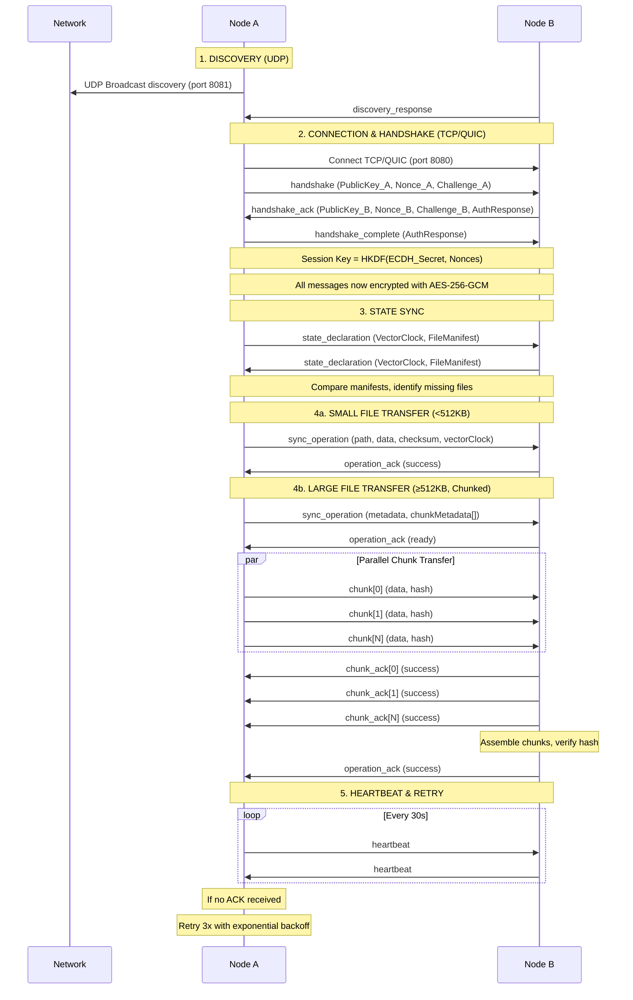

# P2P Folder Sync Communication Protocol

A simple, secure peer-to-peer file synchronization protocol with encryption, chunking, and reliable delivery.

---

## Protocol Flow



---

## Message Format

### Base Message Structure

All messages use a common JSON envelope:

```json
{
  "ID": "msg-1733654130000",
  "Type": "sync_operation",
  "Timestamp": 1733654130000,
  "SenderID": "peer-abc123",
  "Payload": { ... },
  "CorrelationID": "msg-1733654120000"
}
```

**Wire Format:**
```
[12-byte IV] [Encrypted JSON] [16-byte Auth Tag]
```

Encryption: AES-256-GCM with per-message random IV

---

## Discovery

**Method:** UDP broadcast + mDNS

**Discovery Message (UDP Port 8081):**
```json
{
  "PeerID": "peer-abc123",
  "ListenPort": 8080,
  "Capabilities": {
    "encryption": true,
    "compression": true,
    "chunking": true
  },
  "Version": "1.0",
  "Hostname": "node-1"
}
```

**Behavior:**
- Broadcast every 30 seconds to `255.255.255.255:8081`
- Responders send `discovery_response` via unicast
- Alternative: mDNS service type `_p2p-sync._tcp`

---

## Key Exchange & Encryption

### 3-Way Handshake

**1. Initiator → Responder:**
```json
{
  "Type": "handshake",
  "Payload": {
    "PublicKey": [32 bytes],     // ECDH Curve25519
    "Nonce": [32 bytes],          // Random
    "AuthChallenge": [32 bytes]   // Random challenge
  }
}
```

**2. Responder → Initiator:**
```json
{
  "Type": "handshake_ack",
  "Payload": {
    "PublicKey": [32 bytes],
    "Nonce": [32 bytes],
    "AuthChallenge": [32 bytes],
    "AuthResponse": [32 bytes]    // HMAC-SHA256(SharedSecret, Challenge)
  }
}
```

**3. Initiator → Responder:**
```json
{
  "Type": "handshake_complete",
  "Payload": {
    "AuthResponse": [32 bytes]
  }
}
```

### Session Key Derivation

```
SharedSecret = ECDH(MyPrivateKey, PeerPublicKey)
SessionKey = HKDF-SHA256(
    secret: SharedSecret,
    salt: Nonce_A || Nonce_B,
    info: "p2p-sync-session-v1",
    length: 32
)
```

### Message Encryption

```
Plaintext = JSON.Marshal(Message)
IV = Random(12)
Ciphertext = AES-256-GCM.Encrypt(Plaintext, SessionKey, IV)
Wire = IV || Ciphertext || AuthTag
```

**Rotation:** Session keys rotate every 24 hours

---

## File Transfer

### Small Files (<512KB)

**Message:**
```json
{
  "Type": "sync_operation",
  "Payload": {
    "OperationID": "op-xyz789",
    "Type": "create",
    "Path": "docs/file.txt",
    "FileID": "file-abc123",
    "Checksum": "blake3_hash",
    "Size": 102400,
    "Data": [base64 encoded bytes],
    "Compressed": true,
    "CompressionAlgorithm": "zstd",
    "VectorClock": {"peer-A": 5, "peer-B": 3}
  }
}
```

**ACK:**
```json
{
  "Type": "operation_ack",
  "Payload": {
    "OperationID": "op-xyz789",
    "Status": "success"
  }
}
```

### Large Files (≥512KB)

**Step 1 - Metadata:**
```json
{
  "Type": "sync_operation",
  "Payload": {
    "OperationID": "op-xyz789",
    "Path": "videos/large.mp4",
    "FileID": "file-def456",
    "Checksum": "blake3_file_hash",
    "Size": 5242880,
    "TotalChunks": 10,
    "ChunkSize": 524288,
    "ChunkMetadata": [
      {"ChunkID": 0, "Offset": 0, "Length": 524288, "Hash": "chunk0_hash"},
      {"ChunkID": 1, "Offset": 524288, "Length": 524288, "Hash": "chunk1_hash"}
    ],
    "VectorClock": {"peer-A": 6, "peer-B": 3}
  }
}
```

**Step 2 - Chunks:**
```json
{
  "Type": "chunk",
  "Payload": {
    "FileID": "file-def456",
    "ChunkID": 0,
    "TotalChunks": 10,
    "Offset": 0,
    "Length": 524288,
    "ChunkHash": "chunk0_hash",
    "FileHash": "blake3_file_hash",
    "Data": [binary chunk data],
    "IsLast": false
  }
}
```

**Chunk ACK:**
```json
{
  "Type": "chunk_ack",
  "Payload": {
    "FileID": "file-def456",
    "ChunkID": 0,
    "Status": "success"
  }
}
```

**Final ACK (after all chunks assembled):**
```json
{
  "Type": "operation_ack",
  "Payload": {
    "OperationID": "op-xyz789",
    "Status": "success"
  }
}
```

---

## Chunking Behavior

**Strategy:**
- Files <512KB: Send inline (no chunking)
- Files ≥512KB: Chunk into 512KB pieces (up to 2MB for large files)

**Process:**
1. Sender splits file into N chunks
2. Calculate BLAKE3 hash per chunk + full file
3. Send metadata with all chunk hashes
4. Stream chunks (can be parallel, out-of-order)
5. Receiver verifies each chunk hash
6. Assemble when all chunks received
7. Verify final file hash
8. Atomic write (temp file → rename)

**Chunk Size Selection:**
```
< 10MB:    512KB chunks
10-100MB:  1MB chunks
> 100MB:   2MB chunks
```

---

## Retry Protocol

### Exponential Backoff

```
MaxAttempts: 3
BaseDelay: 1 second
MaxDelay: 60 seconds
BackoffFactor: 2.0
```

**Behavior:**
1. Send message
2. Wait for ACK with timeout (30s)
3. If timeout:
   - Retry #1: Wait 1s, resend
   - Retry #2: Wait 2s, resend
   - Retry #3: Wait 4s, resend
4. After 3 failures: Mark operation failed

### Timeout Values

| Message Type | Timeout | Retries |
|--------------|---------|---------|
| handshake | 10s | 3 |
| state_declaration | 30s | 2 |
| sync_operation | 30s | 3 |
| chunk | 30s | 3 |
| heartbeat | 60s | Reconnect |

### Correlation

- Request messages include unique `ID`
- Response messages include `CorrelationID` pointing to request
- Timeout tracked per correlation ID

---

## Compression

**Applied When:**
- File size ≥1MB
- File is not already compressed (.zip, .jpg, .mp4, etc.)

**Algorithms:**
- **zstd** (default): Level 3, ~3x compression, 400 MB/s
- **lz4**: Level 1, ~2x compression, 500 MB/s (for speed)
- **gzip**: Level 6, ~4x compression, 100 MB/s (for ratio)

**Field:** `Compressed: true` + `CompressionAlgorithm: "zstd"`

---

## Transport

**Primary:** QUIC (UDP-based)
- Multiplexed streams
- Built-in TLS 1.3
- Fast handshake (1-RTT)

**Fallback:** TCP
- Used if QUIC fails or UDP blocked
- JSON over persistent TCP connection

**Ports:**
- Discovery: UDP 8081
- Sync: TCP/QUIC 8080

**Keep-Alive:**
- Heartbeat every 30s
- Connection timeout: 60s
- Reconnect with exponential backoff (1s → 5min)

---

## Security Summary

| Component | Algorithm |
|-----------|-----------|
| Key Exchange | ECDH Curve25519 |
| Encryption | AES-256-GCM |
| Key Derivation | HKDF-SHA256 |
| Authentication | HMAC-SHA256 |
| File Integrity | BLAKE3 |

**Properties:**
- Mutual authentication
- Forward secrecy (ephemeral keys)
- Per-message authentication (GCM)
- Replay protection (nonces + timestamps)
- Session key rotation (24h)

---

## Message Types Reference

| Type | Direction | Purpose |
|------|-----------|---------|
| `discovery` | Broadcast | Find peers |
| `discovery_response` | Unicast | Respond to discovery |
| `handshake` | A→B | Begin key exchange |
| `handshake_ack` | B→A | Continue key exchange |
| `handshake_complete` | A→B | Finish key exchange |
| `state_declaration` | Bidirectional | Sync file manifests |
| `sync_operation` | Originator→All | File change (create/update/delete/rename) |
| `chunk` | Sender→Receiver | Transfer file chunk |
| `operation_ack` | Receiver→Sender | Confirm operation |
| `chunk_ack` | Receiver→Sender | Confirm chunk |
| `heartbeat` | Bidirectional | Keep connection alive |

---

**End of Protocol Documentation**
